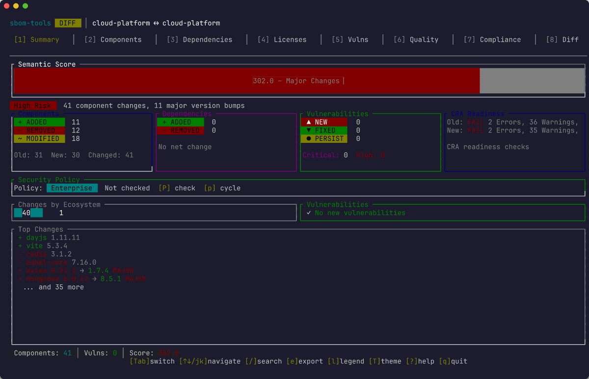
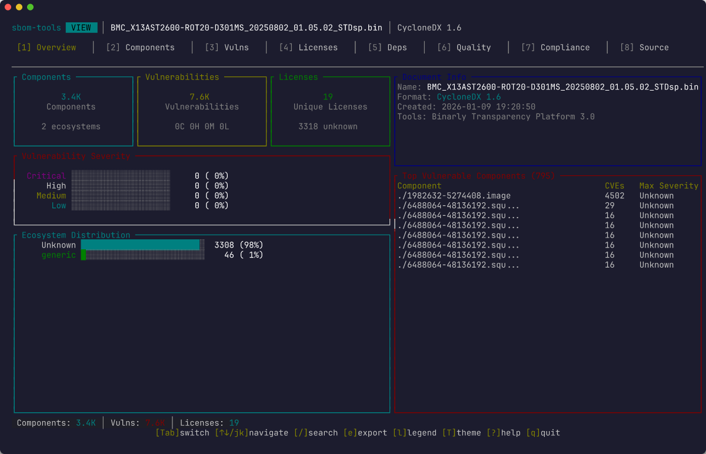
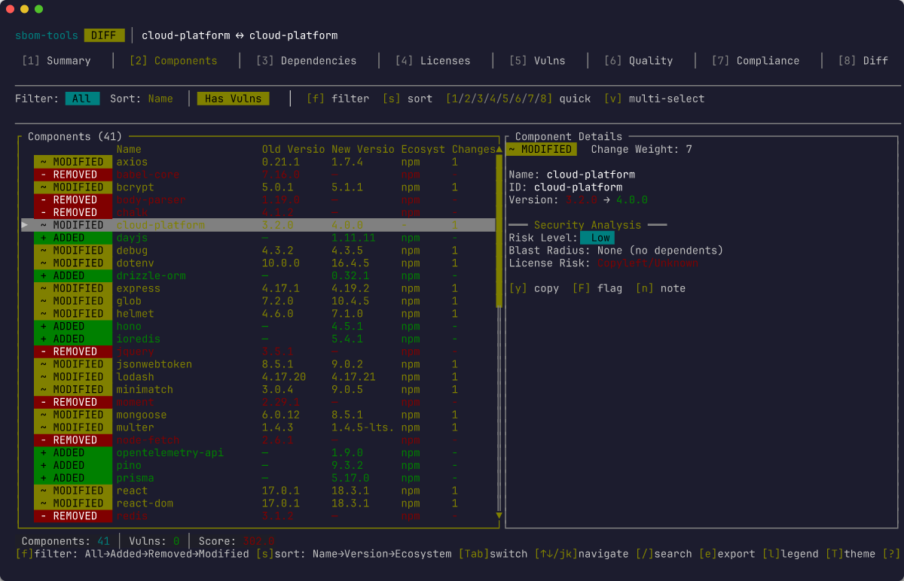
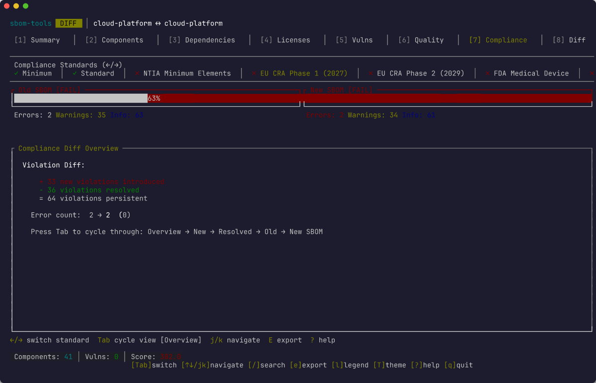
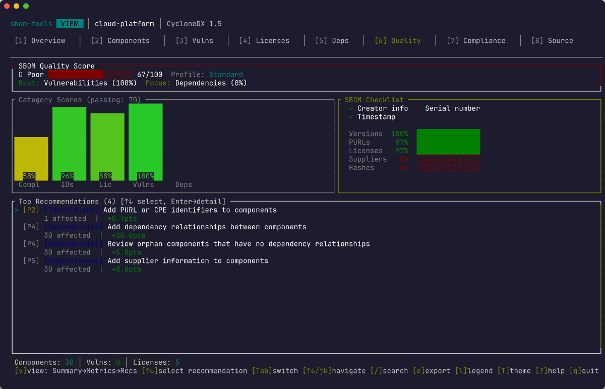
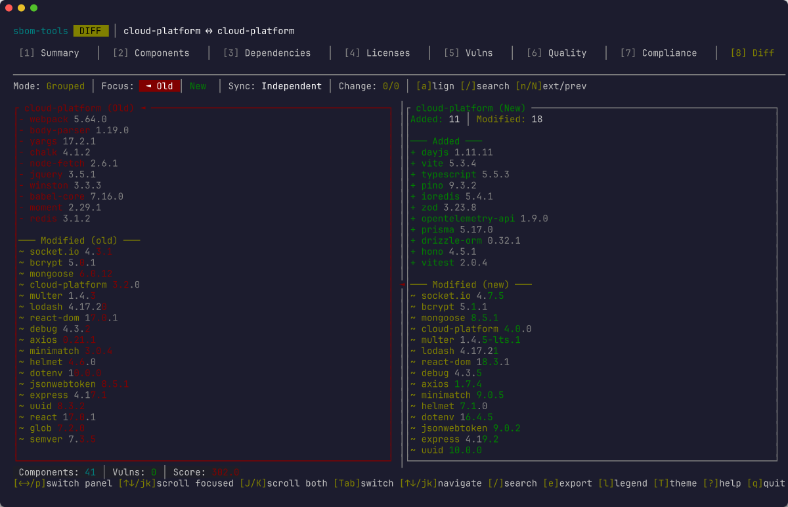

# sbom-tools

[](https://crates.io/crates/sbom-tools)
[](https://github.com/sbom-tool/sbom-tools)
[](https://crates.io/crates/sbom-tools)

A semantic SBOM (Software Bill of Materials) diff and analysis tool. Compare, validate, and assess the quality of SBOMs across CycloneDX and SPDX formats.





## Features

- **Semantic Diffing** — Component-level change detection (added, removed, modified), dependency graph diffing, vulnerability tracking, and license change analysis
- **Multi-Format Support** — CycloneDX (1.4–1.6) and SPDX (2.2–2.3) in JSON, XML, tag-value, and RDF/XML with automatic format detection
- **Streaming Parser** — Memory-efficient parsing for very large SBOMs (>512MB) with progress reporting
- **Fuzzy Matching** — Multi-tier matching engine using exact PURL match, alias lookup, ecosystem-specific normalization, and string similarity with adaptive thresholds and LSH indexing
- **Vulnerability Enrichment** — Integration with OSV and KEV databases to track new and resolved vulnerabilities (feature-gated)
- **Quality Assessment** — Score SBOMs against compliance standards including NTIA minimum elements, FDA, and CRA (Cyber Resilience Act)
- **Fleet Comparison** — 1:N baseline comparison, timeline analysis across versions, and NxN matrix analysis
- **Incremental Diff** — Track changes across SBOM versions with drift detection and divergence analysis
- **Multiple Output Formats** — JSON, SARIF, HTML, Markdown, CSV, table, side-by-side, summary, and an interactive TUI
- **Ecosystem-Aware** — Configurable per-ecosystem normalization rules, typosquat detection, and cross-ecosystem package correlation

## Installation

### From crates.io

```sh
cargo install sbom-tools
```

### Build from source

Requires Rust 1.86+.

```sh
# Release build (includes vulnerability enrichment by default)
cargo build --release

# Without enrichment (lightweight build)
cargo build --release --no-default-features
```

The binary is placed at `target/release/sbom-tools`.

## Quick Start

```sh
# Compare two SBOMs
sbom-tools diff old-sbom.json new-sbom.json

# View SBOM contents interactively
sbom-tools view sbom.json

# Validate compliance
sbom-tools validate sbom.json --standard ntia

# Assess quality
sbom-tools quality sbom.json --profile security --recommendations
```

## Usage

### Compare two SBOMs

```sh
sbom-tools diff old-sbom.json new-sbom.json
```

#### Common diff options

| Flag | Description |
|------|-------------|
| `--fail-on-change` | Exit with code 1 if changes are detected |
| `--fail-on-vuln` | Exit with code 2 if new vulnerabilities are introduced |
| `--graph-diff` | Enable dependency graph structure diffing |
| `--ecosystem-rules <path>` | Load custom per-ecosystem normalization rules |
| `--fuzzy-preset <preset>` | Matching preset: `strict`, `balanced` (default), `permissive` |
| `--enrich-vulns` | Query OSV/KEV databases for vulnerability data |
| `--detect-typosquats` | Flag components that look like known-package typosquats |
| `--explain-matches` | Show why each component pair was matched |

#### Example output

```
sbom-tools diff old-sbom.json new-sbom.json --enrich-vulns

SBOM Diff: old-sbom.json → new-sbom.json

Components: 142 → 145 (+5 added, -2 removed, ~3 modified)

 + pkg:npm/express@4.19.2           (added)
 + pkg:npm/zod@3.23.8               (added)
 + pkg:npm/opentelemetry-api@1.9.0  (added)
 + pkg:npm/ws@8.18.0                (added)
 + pkg:npm/pino@9.3.2               (added)
 - pkg:npm/body-parser@1.20.2       (removed)
 - pkg:npm/winston@3.11.0           (removed)
 ~ pkg:npm/lodash@4.17.20 → 4.17.21  (version bump)
 ~ pkg:npm/axios@1.6.0 → 1.7.4       (version bump)
 ~ pkg:npm/semver@7.5.4 → 7.6.3      (version bump)

Vulnerabilities:
 ✗ CVE-2024-29041 (HIGH) — express <4.19.2  [resolved by upgrade]
 ✗ CVE-2024-4068  (HIGH) — braces <3.0.3    [new, in transitive dep]

License changes: none
```

### View a single SBOM

```sh
sbom-tools view sbom.json
```

Launches an interactive TUI with component tree, vulnerability details, license breakdown, and dependency graph. Key flags:

| Flag | Description |
|------|-------------|
| `--severity <level>` | Filter by minimum vulnerability severity (`critical`, `high`, `medium`, `low`) |
| `--vulnerable-only` | Only show components with known vulnerabilities |
| `--ecosystem <name>` | Filter components by ecosystem (e.g., `npm`, `cargo`, `pypi`) |
| `--validate-ntia` | Validate against NTIA minimum elements |

### Validate against a compliance standard

```sh
sbom-tools validate sbom.json --standard ntia
sbom-tools validate sbom.json --standard cra -o sarif -O results.sarif
```

Checks an SBOM against a compliance standard and reports missing fields or failing requirements.

| Flag | Description |
|------|-------------|
| `--standard <std>` | Standard to validate: `ntia` (default), `fda`, `cra` |
| `-o, --output <fmt>` | Output format (default: `json`; supports `sarif` for CI integration) |

### Assess SBOM quality

```sh
sbom-tools quality sbom.json --profile security --recommendations
```

Scores an SBOM from 0–100 using a weighted profile. Use `--min-score` to fail CI if quality drops below a threshold.

| Flag | Description |
|------|-------------|
| `--profile <name>` | Scoring profile (see table below) |
| `--min-score <n>` | Fail if quality score is below threshold (0–100) |
| `--recommendations` | Show detailed improvement recommendations |
| `--metrics` | Show detailed scoring metrics |

#### Quality profiles

| Profile | Description |
|---------|-------------|
| `minimal` | Basic field presence checks |
| `standard` | Default — balanced coverage of all quality dimensions |
| `security` | Emphasizes vulnerability data, CPE/PURL identifiers, and hash completeness |
| `license-compliance` | Focuses on license identification and SPDX expression validity |
| `cra` | Cyber Resilience Act readiness |
| `comprehensive` | All checks at maximum weight |

### Fleet comparison

For comparing multiple SBOMs across a project portfolio:

```sh
# Compare a baseline against multiple targets (1:N)
sbom-tools diff-multi baseline.json target1.json target2.json target3.json

# Track evolution over time (provide SBOMs in chronological order)
sbom-tools timeline v1.json v2.json v3.json

# All-pairs comparison matrix (NxN)
sbom-tools matrix sbom1.json sbom2.json sbom3.json
```

### Generate shell completions

```sh
sbom-tools completions bash > ~/.local/share/bash-completion/completions/sbom-tools
sbom-tools completions zsh > ~/.zfunc/_sbom-tools
sbom-tools completions fish > ~/.config/fish/completions/sbom-tools.fish
```

### Export config schema

```sh
sbom-tools config-schema > schema.json
```

## Interactive TUI

Both `diff` and `view` commands launch an interactive terminal UI by default when connected to a TTY.

**Diff mode tabs:** Summary, Components, Dependencies, Licenses, Vulnerabilities, Quality, Compliance, Side-by-Side, Graph Changes, Source

**View mode tabs:** Overview, Tree, Vulnerabilities, Licenses, Dependencies, Quality, Compliance, Source









**Navigation:**

| Key | Action |
|-----|--------|
| `Tab` / `Shift+Tab` | Switch between tabs |
| `1`–`0` | Jump to tab by number |
| `↑` / `↓` | Navigate list items |
| `Enter` | Expand / drill into selection |
| `Ctrl+F` or `/` | Search |
| `f` | Toggle filter panel |
| `s` | Cycle sort order |
| `q` / `Esc` | Quit |

## Output Formats

Select with `-o` / `--output`:

| Format | Flag | Use Case |
|--------|------|----------|
| Auto | `auto` | Default — TUI if TTY, summary otherwise |
| TUI | `tui` | Interactive exploration |
| JSON | `json` | Programmatic integration |
| SARIF | `sarif` | CI/CD security dashboards (SARIF 2.1.0) |
| Markdown | `markdown` | Documentation, PR comments |
| HTML | `html` | Stakeholder reports |
| CSV | `csv` | Spreadsheet analysis |
| Summary | `summary` | Terminal quick overview |
| Table | `table` | Aligned, colored terminal output |
| Side-by-side | `side-by-side` | Terminal diff comparison |

## CI/CD Integration

Use sbom-tools in CI pipelines to gate deployments on SBOM changes, new vulnerabilities, or quality regressions.

```sh
# Fail if any components changed
sbom-tools diff old.json new.json --fail-on-change -o summary

# Fail if new vulnerabilities are introduced, output SARIF for dashboards
sbom-tools diff old.json new.json --fail-on-vuln --enrich-vulns -o sarif -O results.sarif

# Fail if quality score drops below 80
sbom-tools quality sbom.json --profile security --min-score 80 -o json

# Validate CRA compliance
sbom-tools validate sbom.json --standard cra -o sarif -O compliance.sarif
```

Check `$?` for the exit code (see below) to determine pass/fail in your pipeline.

## Exit Codes

| Code | Meaning |
|------|---------|
| `0` | Success (no changes detected, or run without `--fail-on-change`) |
| `1` | Changes detected (`--fail-on-change`) |
| `2` | New vulnerabilities introduced (`--fail-on-vuln`) |
| `3` | Error |

## Configuration

sbom-tools looks for configuration in the following order:

1. CLI argument: `--ecosystem-rules <path>`
2. Environment variable: `SBOM_TOOLS_ECOSYSTEM_RULES`
3. Project local: `.sbom-tools/ecosystem-rules.yaml`
4. User config: `~/.config/sbom-tools/ecosystem-rules.yaml`

See [`examples/ecosystem-rules.yaml`](examples/ecosystem-rules.yaml) for a full configuration example covering per-ecosystem normalization, aliases, matching presets, and enrichment settings.

### Matching presets

| Preset | Description |
|--------|-------------|
| `strict` | Exact matches only |
| `balanced` | Default — uses normalization and moderate similarity thresholds |
| `permissive` | Aggressive fuzzy matching for noisy SBOMs |

## Global Flags

| Flag | Description |
|------|-------------|
| `-o, --output <fmt>` | Output format (see [Output Formats](#output-formats)) |
| `-v, --verbose` | Enable debug output |
| `-q, --quiet` | Suppress non-essential output |
| `--no-color` | Disable colored output (also respects the `NO_COLOR` environment variable) |

## Project Structure

```
src/
├── cli/          Command handlers (diff, view, validate, quality, fleet commands)
├── config/       YAML/JSON config with presets, validation, schema generation
├── model/        Canonical SBOM representation (NormalizedSbom, Component, CanonicalId)
├── parsers/      Format detection + parsing (streaming for >512MB)
├── matching/     Multi-tier fuzzy matching (PURL, alias, ecosystem, adaptive, LSH)
├── diff/         Semantic diffing engine with graph support + incremental diff
├── enrichment/   OSV/KEV vulnerability data (feature-gated), file cache with TTL
├── quality/      NTIA/FDA/CRA compliance scoring
├── pipeline/     parse → enrich → diff → report orchestration
├── reports/      Output format generators + streaming reporter
└── tui/          Ratatui-based interactive UI
```

See [`docs/ARCHITECTURE.md`](docs/ARCHITECTURE.md) for detailed module responsibilities and data flow.

## Testing

```sh
# Run all tests
cargo test

# Run benchmarks
cargo bench
```

## Documentation

- [Architecture overview](docs/ARCHITECTURE.md)
- [Pipeline diagrams](docs/pipeline-diagrams.md)

## Contributing

Contributions are welcome! Please open an issue to discuss your idea before submitting a pull request. Make sure `cargo test` passes and follow the existing code style.

## License

[MIT](LICENSE)
