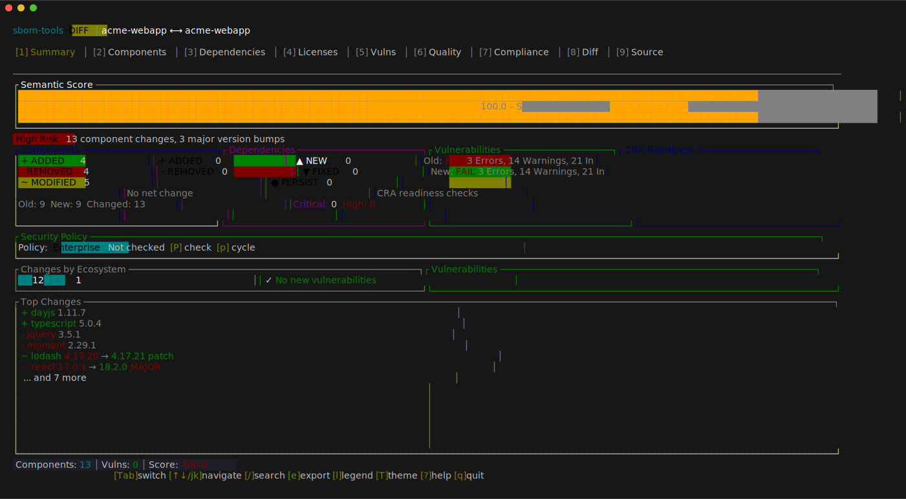
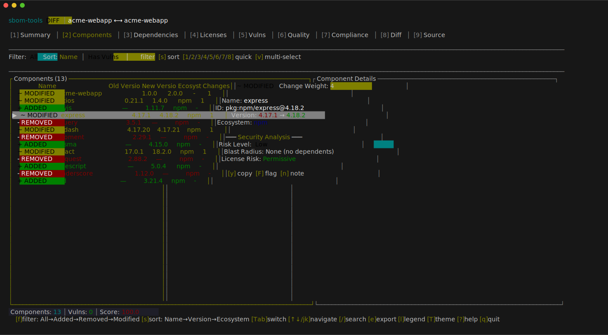
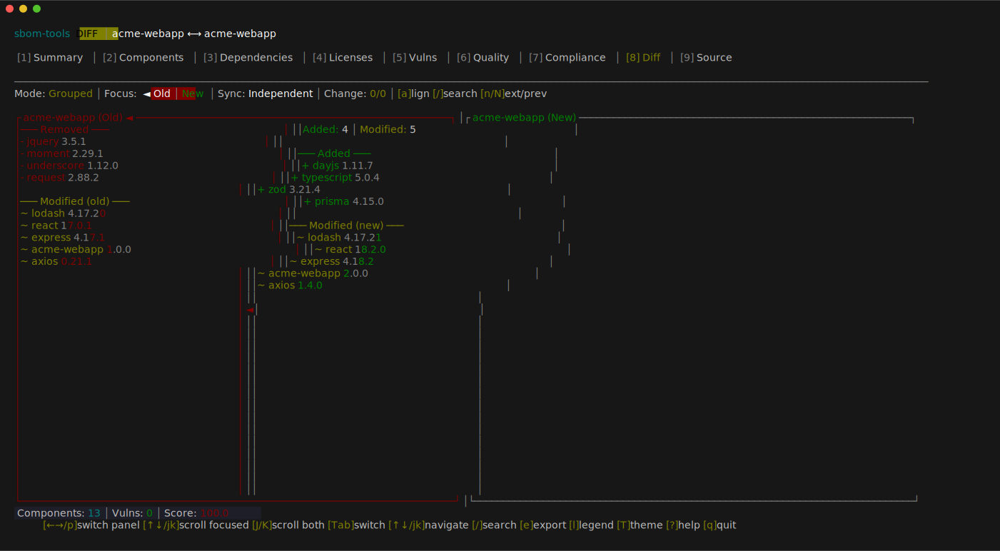
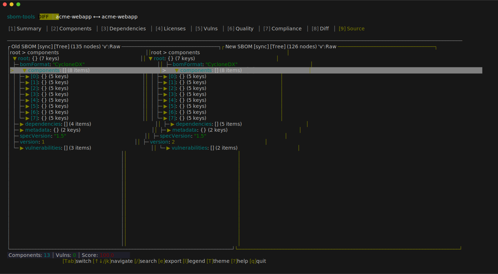
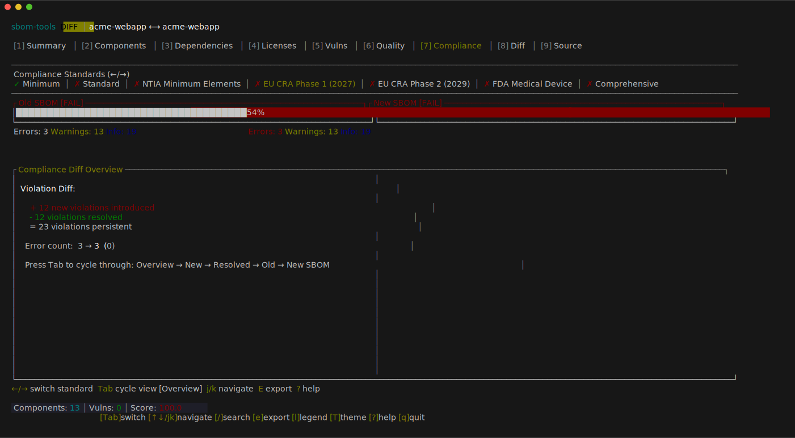
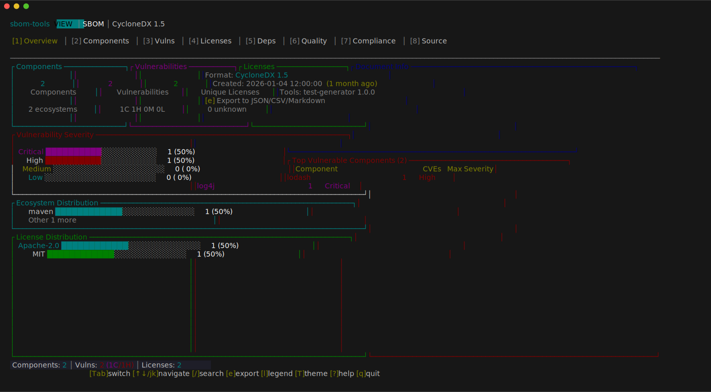
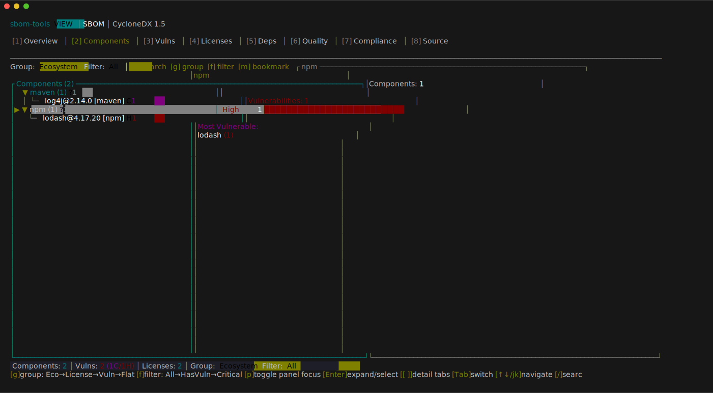
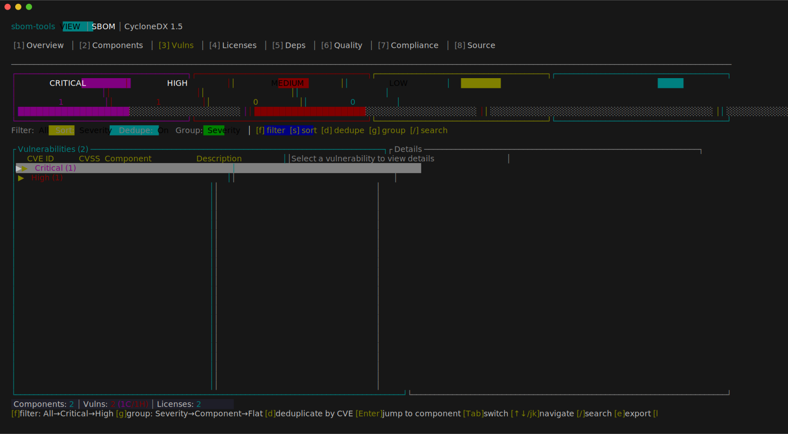
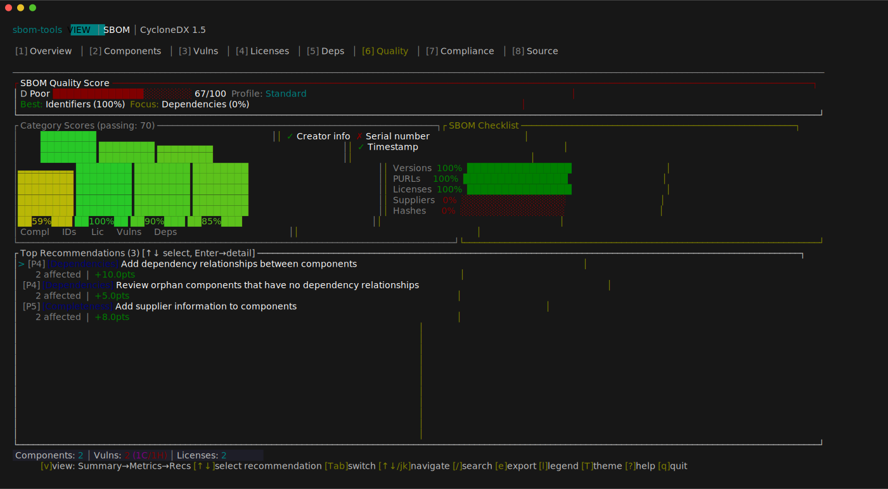

<p align="center">
  
</p>

<h1 align="center">sbom-tools</h1>

<p align="center">
  Know exactly what changed in your software supply chain.
</p>

<p align="center">
  <a href="https://github.com/sbom-tool/sbom-tools/actions/workflows/rust.yml"></a>
  <a href="https://crates.io/crates/sbom-tools"></a>
  <a href="https://docs.rs/sbom-tools"></a>
  <a href="https://crates.io/crates/sbom-tools"></a>
  <a href="https://deps.rs/repo/github/sbom-tool/sbom-tools"></a>
  <a href="https://github.com/sbom-tool/sbom-tools"></a>
  <a href="https://github.com/sbom-tool/sbom-tools"></a>
</p>

Semantic SBOM diff and analysis tool. Compare, validate, and assess the quality of SBOMs across CycloneDX and SPDX formats.



## Features

- **Semantic Diffing** — Component-level change detection (added, removed, modified), dependency graph diffing, vulnerability tracking, and license change analysis
- **Multi-Format Support** — CycloneDX (1.4–1.6) and SPDX (2.2–2.3) in JSON, XML, tag-value, and RDF/XML with automatic format detection
- **Streaming Parser** — Memory-efficient parsing for very large SBOMs (>512MB) with progress reporting
- **Fuzzy Matching** — Multi-tier matching engine using exact PURL match, alias lookup, ecosystem-specific normalization, and string similarity with adaptive thresholds and LSH indexing
- **Vulnerability Enrichment** — Integration with OSV and KEV databases to track new and resolved vulnerabilities (feature-gated)
- **EOL Detection** — End-of-life status for components via endoflife.date API with TUI visualization and compliance integration (feature-gated)
- **Quality Assessment** — Score SBOMs against compliance standards including NTIA, FDA, CRA (Cyber Resilience Act), NIST SSDF, and EO 14028
- **Fleet Comparison** — 1:N baseline comparison, timeline analysis across versions, and NxN matrix analysis
- **Incremental Diff** — Track changes across SBOM versions with drift detection and divergence analysis
- **Multiple Output Formats** — JSON, SARIF, HTML, Markdown, CSV, table, side-by-side, summary, and an interactive TUI
- **Ecosystem-Aware** — Configurable per-ecosystem normalization rules, typosquat detection, and cross-ecosystem package correlation

## Installation

### From crates.io

```sh
cargo install sbom-tools
```

### Build from source

Requires Rust 1.86+.

```sh
# Release build (includes vulnerability enrichment by default)
cargo build --release

# Without enrichment (lightweight build)
cargo build --release --no-default-features
```

The binary is placed at `target/release/sbom-tools`.

## Usage

```sh
# Compare two SBOMs
sbom-tools diff old-sbom.json new-sbom.json

# View SBOM contents interactively
sbom-tools view sbom.json

# Search for components across SBOMs
sbom-tools query "log4j" --version "<2.17.0" fleet/*.json

# Validate compliance
sbom-tools validate sbom.json --standard ntia

# Assess quality
sbom-tools quality sbom.json --profile security --recommendations
```

### Diff

```sh
sbom-tools diff old-sbom.json new-sbom.json
```

Compares two SBOMs and reports added, removed, and modified components with version diffs, vulnerability changes, and license deltas.

<details>
<summary>Diff options</summary>

| Flag | Description |
|------|-------------|
| `--fail-on-change` | Exit with code 1 if changes are detected |
| `--fail-on-vuln` | Exit with code 2 if new vulnerabilities are introduced |
| `--graph-diff` | Enable dependency graph structure diffing |
| `--ecosystem-rules <path>` | Load custom per-ecosystem normalization rules |
| `--fuzzy-preset <preset>` | Matching preset: `strict`, `balanced` (default), `permissive` |
| `--enrich-vulns` | Query OSV/KEV databases for vulnerability data |
| `--enrich-eol` | Detect end-of-life status via endoflife.date API |
| `--detect-typosquats` | Flag components that look like known-package typosquats |
| `--explain-matches` | Show why each component pair was matched |

</details>

<details>
<summary>Example output</summary>

```
sbom-tools diff old-sbom.json new-sbom.json --enrich-vulns

SBOM Diff: old-sbom.json → new-sbom.json

Components: 142 → 145 (+5 added, -2 removed, ~3 modified)

 + pkg:npm/express@4.19.2           (added)
 + pkg:npm/zod@3.23.8               (added)
 + pkg:npm/opentelemetry-api@1.9.0  (added)
 + pkg:npm/ws@8.18.0                (added)
 + pkg:npm/pino@9.3.2               (added)
 - pkg:npm/body-parser@1.20.2       (removed)
 - pkg:npm/winston@3.11.0           (removed)
 ~ pkg:npm/lodash@4.17.20 → 4.17.21  (version bump)
 ~ pkg:npm/axios@1.6.0 → 1.7.4       (version bump)
 ~ pkg:npm/semver@7.5.4 → 7.6.3      (version bump)

Vulnerabilities:
 ✗ CVE-2024-29041 (HIGH) — express <4.19.2  [resolved by upgrade]
 ✗ CVE-2024-4068  (HIGH) — braces <3.0.3    [new, in transitive dep]

License changes: none
```

</details>

### View

```sh
sbom-tools view sbom.json
```

Launches an interactive TUI with component tree, vulnerability details, license breakdown, and dependency graph.

<details>
<summary>View options</summary>

| Flag | Description |
|------|-------------|
| `--severity <level>` | Filter by minimum vulnerability severity (`critical`, `high`, `medium`, `low`) |
| `--vulnerable-only` | Only show components with known vulnerabilities |
| `--ecosystem <name>` | Filter components by ecosystem (e.g., `npm`, `cargo`, `pypi`) |
| `--enrich-eol` | Detect end-of-life status via endoflife.date API |
| `--validate-ntia` | Validate against NTIA minimum elements |

</details>

### Validate

```sh
sbom-tools validate sbom.json --standard ntia
sbom-tools validate sbom.json --standard cra -o sarif -O results.sarif
```

Checks an SBOM against a compliance standard and reports missing fields or failing requirements.

<details>
<summary>Validate options</summary>

| Flag | Description |
|------|-------------|
| `--standard <std>` | Standard to validate: `ntia` (default), `fda`, `cra`, `ssdf`, `eo14028` (comma-separated for multiple) |
| `-o, --output <fmt>` | Output format (default: `json`; supports `sarif` for CI integration) |

</details>

### Quality

```sh
sbom-tools quality sbom.json --profile security --recommendations
```

Scores an SBOM from 0–100 using a weighted profile. Use `--min-score` to fail CI if quality drops below a threshold.

<details>
<summary>Quality options</summary>

| Flag | Description |
|------|-------------|
| `--profile <name>` | Scoring profile: `minimal`, `standard` (default), `security`, `license-compliance`, `cra`, `comprehensive` |
| `--min-score <n>` | Fail if quality score is below threshold (0–100) |
| `--recommendations` | Show detailed improvement recommendations |
| `--metrics` | Show detailed scoring metrics |

</details>

### Query

```sh
sbom-tools query "log4j" sbom1.json sbom2.json sbom3.json
```

Search for components across multiple SBOMs by name, version, ecosystem, license, supplier, or vulnerability ID. Answers the "where is Log4j?" question across your entire SBOM fleet.

<details>
<summary>Query options</summary>

| Flag | Description |
|------|-------------|
| `--name <str>` | Filter by component name (substring) |
| `--version <ver>` | Filter by version — exact match or semver range (e.g., `<2.17.0`) |
| `--ecosystem <eco>` | Filter by ecosystem (e.g., `npm`, `maven`, `pypi`) |
| `--license <str>` | Filter by license (substring) |
| `--purl <str>` | Filter by PURL (substring) |
| `--supplier <str>` | Filter by supplier name (substring) |
| `--affected-by <id>` | Filter by vulnerability ID (e.g., `CVE-2021-44228`) |
| `--enrich-vulns` | Query OSV databases for vulnerability data |
| `--enrich-eol` | Detect end-of-life status via endoflife.date API |
| `--limit <n>` | Maximum number of results |
| `--group-by-sbom` | Group output by SBOM source |

</details>

<details>
<summary>Example output</summary>

```
$ sbom-tools query "log4j" --version "<2.17.0" fleet/*.cdx.json

Query: "log4j" AND version=<2.17.0 across 5 SBOMs (1247 total components)

COMPONENT  VERSION  ECOSYSTEM  LICENSE     VULNS  FOUND IN
log4j      2.14.0   maven      Apache-2.0      1  firmware-v1, device-a
log4j      2.14.1   maven      Apache-2.0      1  gateway

2 components found across 5 SBOMs

$ sbom-tools query --ecosystem pypi *.json --group-by-sbom

Query: ecosystem=pypi across 2 SBOMs (33 total components)

── backend-v3 (4 matches / 18 components) ──
  django 4.2.11 (pypi)
  flask 3.0.2 (pypi)
  celery 5.3.6 (pypi)
  numpy 1.26.4 (pypi)

── backend-v2 (4 matches / 15 components) ──
  django 3.2.23 (pypi)
  flask 2.2.5 (pypi)
  celery 5.3.4 (pypi)
  numpy 1.24.4 (pypi)

8 components found across 2 SBOMs
```

</details>

### Fleet comparison

Compare multiple SBOMs across a project portfolio:

```sh
# Compare a baseline against multiple targets (1:N)
sbom-tools diff-multi baseline.json target1.json target2.json target3.json

# Track evolution over time (provide SBOMs in chronological order)
sbom-tools timeline v1.json v2.json v3.json

# All-pairs comparison matrix (NxN)
sbom-tools matrix sbom1.json sbom2.json sbom3.json
```

### Shell completions

```sh
sbom-tools completions bash > ~/.local/share/bash-completion/completions/sbom-tools
sbom-tools completions zsh > ~/.zfunc/_sbom-tools
sbom-tools completions fish > ~/.config/fish/completions/sbom-tools.fish
```

### Global flags

| Flag | Description |
|------|-------------|
| `-o, --output <fmt>` | Output format (see [Output Formats](#output-formats)) |
| `-v, --verbose` | Enable debug output |
| `-q, --quiet` | Suppress non-essential output |
| `--no-color` | Disable colored output (also respects `NO_COLOR`) |

## Interactive TUI

Both `diff` and `view` commands launch an interactive terminal UI by default when connected to a TTY.

### Diff Mode

Compare two SBOMs with semantic change detection across 9 tabs.

**Summary** — Overall change score with component, vulnerability, and compliance breakdowns at a glance.


**Components** — Every added, removed, and modified component with version diffs and ecosystem tags.



<details>
<summary>More diff screenshots</summary>

**Side-by-Side** — Aligned dual-panel comparison with synchronized scrolling.



**Source** — Raw SBOM JSON in a synced dual-panel tree view. Press `s` to lock navigation across panels.



**Compliance** — CRA, NTIA, FDA, NIST SSDF, and EO 14028 readiness checks with pass/fail details for each requirement.



</details>

### View Mode

Explore a single SBOM interactively across 8 tabs.

**Overview** — SBOM metadata, component statistics, and vulnerability summary.



**Components** — Expandable component tree grouped by ecosystem.



<details>
<summary>More view screenshots</summary>

**Vulnerabilities** — CVE table with severity, CVSS scores, and affected components.



**Quality** — Weighted quality score with category breakdown and improvement recommendations.



</details>

### Navigation

| Key | Action |
|-----|--------|
| `1`–`0` / `Tab` | Switch tabs |
| `↑↓` / `jk` | Navigate items |
| `Enter` / `Space` | Expand / collapse |
| `/` | Search |
| `f` | Filter panel |
| `s` | Sync panels (Source) / sort |
| `w` | Switch focus (Source, Side-by-Side) |
| `v` | Tree / raw toggle (Source) |
| `e` | Export |
| `T` | Cycle theme |
| `q` | Quit |

## Output Formats

Select with `-o` / `--output`:

| Format | Flag | Use Case |
|--------|------|----------|
| Auto | `auto` | Default — TUI if TTY, summary otherwise |
| TUI | `tui` | Interactive exploration |
| JSON | `json` | Programmatic integration |
| SARIF | `sarif` | CI/CD security dashboards (SARIF 2.1.0) |
| Markdown | `markdown` | Documentation, PR comments |
| HTML | `html` | Stakeholder reports |
| CSV | `csv` | Spreadsheet analysis |
| Summary | `summary` | Terminal quick overview |
| Table | `table` | Aligned, colored terminal output |
| Side-by-side | `side-by-side` | Terminal diff comparison |

## CI/CD Integration

Use sbom-tools in CI pipelines to gate deployments on SBOM changes, new vulnerabilities, or quality regressions.

```sh
# Fail if any components changed
sbom-tools diff old.json new.json --fail-on-change -o summary

# Fail if new vulnerabilities are introduced, output SARIF for dashboards
sbom-tools diff old.json new.json --fail-on-vuln --enrich-vulns -o sarif -O results.sarif

# Fail if quality score drops below 80
sbom-tools quality sbom.json --profile security --min-score 80 -o json

# Validate CRA compliance
sbom-tools validate sbom.json --standard cra -o sarif -O compliance.sarif

# Check for vulnerable Log4j versions across all SBOMs (exits 1 if found)
sbom-tools query "log4j" --version "<2.17.0" fleet/*.json -o json
```

<details>
<summary>GitHub Actions example</summary>

```yaml
name: SBOM Check

on:
  pull_request:
    paths: ['sbom.json']

jobs:
  sbom-gate:
    runs-on: ubuntu-latest
    steps:
      - uses: actions/checkout@v4
        with:
          fetch-depth: 2

      - name: Install sbom-tools
        run: cargo install sbom-tools

      - name: Diff SBOM against main
        run: |
          git show HEAD~1:sbom.json > /tmp/old-sbom.json
          sbom-tools diff /tmp/old-sbom.json sbom.json \
            --fail-on-vuln --enrich-vulns \
            -o sarif -O results.sarif

      - name: Upload SARIF
        if: always()
        uses: github/codeql-action/upload-sarif@v3
        with:
          sarif_file: results.sarif
```

</details>

### Exit codes

| Code | Meaning |
|------|---------|
| `0` | Success (no changes detected, or run without `--fail-on-change`) |
| `1` | Changes detected (`--fail-on-change`) |
| `2` | New vulnerabilities introduced (`--fail-on-vuln`) |
| `3` | Error |

## Configuration

sbom-tools looks for configuration in the following order:

1. CLI argument: `--ecosystem-rules <path>`
2. Environment variable: `SBOM_TOOLS_ECOSYSTEM_RULES`
3. Project local: `.sbom-tools/ecosystem-rules.yaml`
4. User config: `~/.config/sbom-tools/ecosystem-rules.yaml`

See [`examples/ecosystem-rules.yaml`](examples/ecosystem-rules.yaml) for a full configuration example covering per-ecosystem normalization, aliases, matching presets, and enrichment settings.

### Matching presets

| Preset | Description |
|--------|-------------|
| `strict` | Exact matches only |
| `balanced` | Default — uses normalization and moderate similarity thresholds |
| `permissive` | Aggressive fuzzy matching for noisy SBOMs |

## Project Structure

```
src/
├── cli/          Command handlers (diff, view, validate, quality, query, fleet commands)
├── config/       YAML/JSON config with presets, validation, schema generation
├── model/        Canonical SBOM representation (NormalizedSbom, Component, CanonicalId)
├── parsers/      Format detection + parsing (streaming for >512MB)
├── matching/     Multi-tier fuzzy matching (PURL, alias, ecosystem, adaptive, LSH)
├── diff/         Semantic diffing engine with graph support + incremental diff
├── enrichment/   OSV/KEV vulnerability data + EOL detection (feature-gated), file cache with TTL
├── quality/      NTIA/FDA/CRA/NIST SSDF/EO 14028 compliance scoring
├── pipeline/     parse → enrich → diff → report orchestration
├── reports/      Output format generators + streaming reporter
└── tui/          Ratatui-based interactive UI
```

See [`docs/ARCHITECTURE.md`](docs/ARCHITECTURE.md) for detailed module responsibilities and data flow.

## Testing

```sh
# Run all tests
cargo test

# Run benchmarks
cargo bench
```

## Documentation

- [Architecture overview](docs/ARCHITECTURE.md)
- [Pipeline diagrams](docs/pipeline-diagrams.md)
- [Releases and changelog](https://github.com/sbom-tool/sbom-tools/releases)

## Contributing

Contributions are welcome! Please open an issue to discuss your idea before submitting a pull request. Make sure `cargo test` passes and follow the existing code style.

## License

[MIT](LICENSE)
