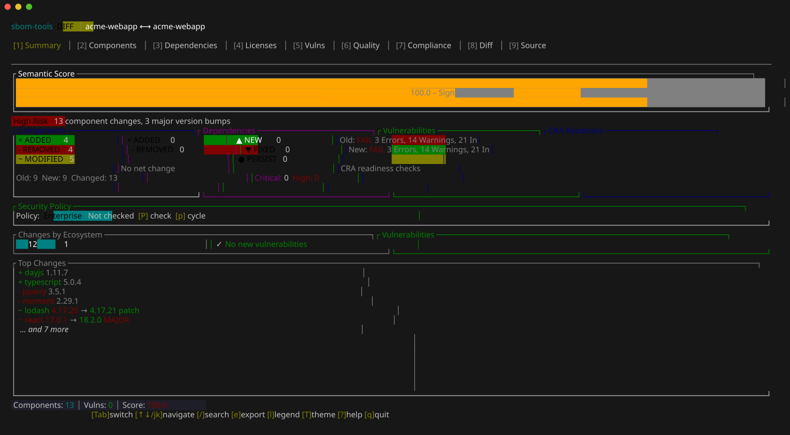
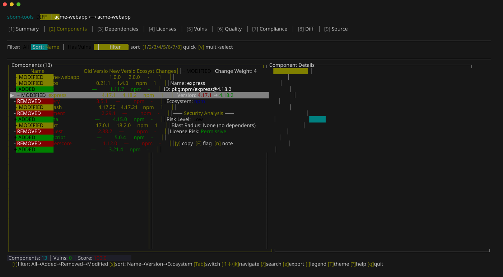
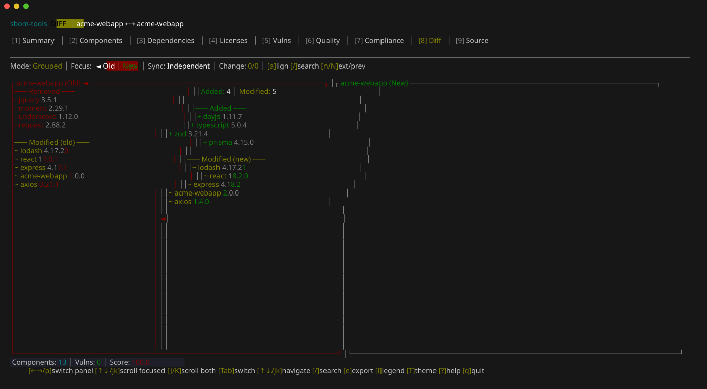
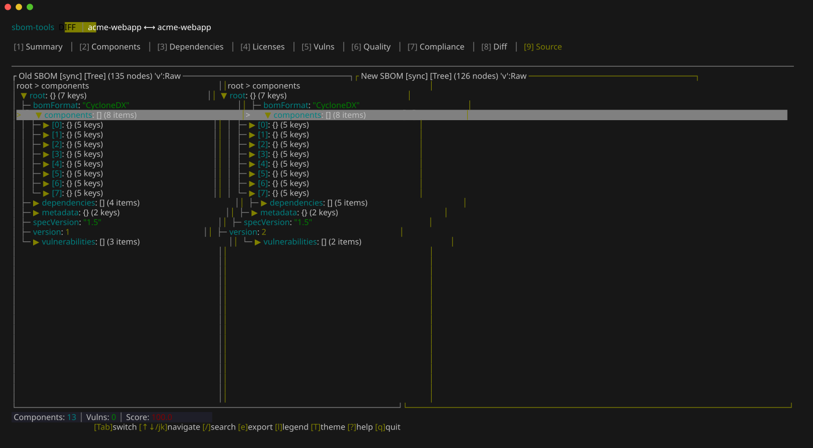
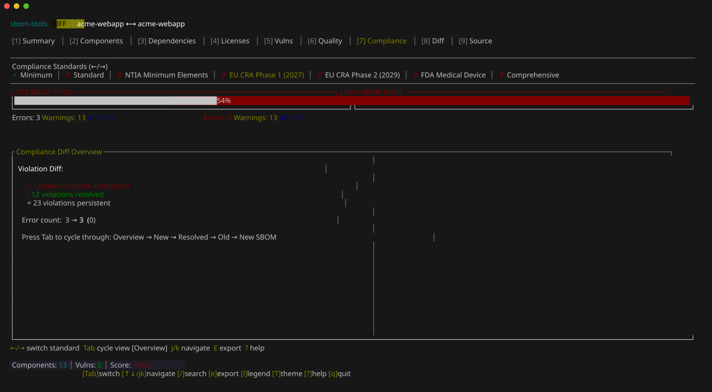
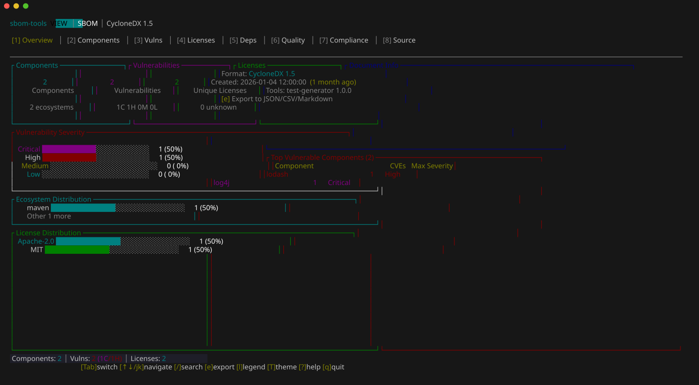
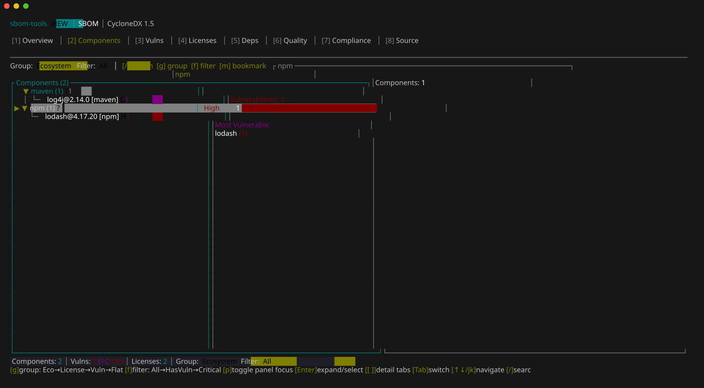
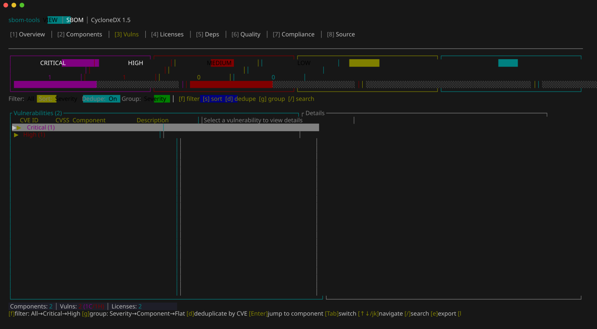
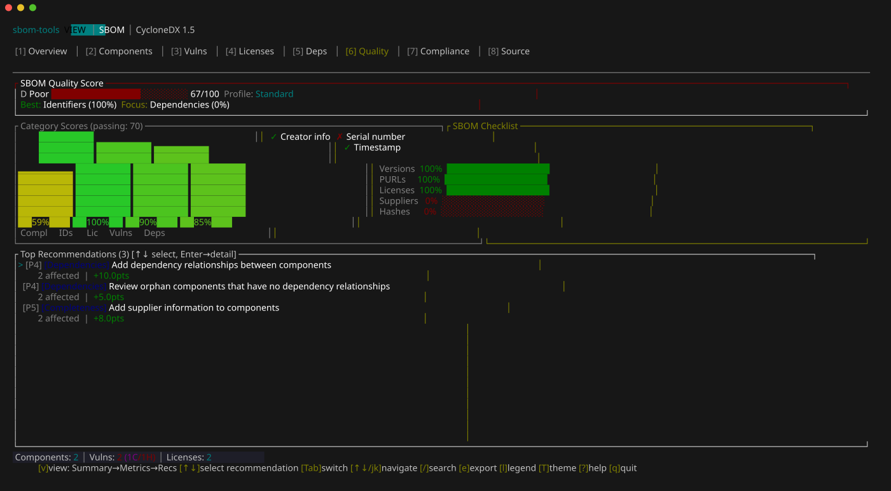

<p align="center">
  
</p>

<h1 align="center">sbom-tools</h1>

<p align="center">
  Know exactly what changed in your software supply chain — from components to cryptography.
</p>

<p align="center">
  <a href="https://github.com/sbom-tool/sbom-tools/actions/workflows/rust.yml"></a>
  <a href="https://crates.io/crates/sbom-tools"></a>
  <a href="https://docs.rs/sbom-tools"></a>
  <a href="https://crates.io/crates/sbom-tools"></a>
  <a href="https://deps.rs/repo/github/sbom-tool/sbom-tools"></a>
  <a href="https://github.com/sbom-tool/sbom-tools"></a>
  <a href="https://github.com/sbom-tool/sbom-tools"></a>
  <a href="https://www.bestpractices.dev/projects/11992"></a>
  <a href="https://scorecard.dev/viewer/?uri=github.com/sbom-tool/sbom-tools"></a>
</p>

Semantic SBOM/CBOM diff, quality scoring, and analysis tool. Compare, validate, and grade software and cryptographic bills of materials across CycloneDX and SPDX formats.



## Start with the big picture

`sbom-tools` converts CycloneDX and SPDX documents into one canonical model,
then uses the same Rust engine for semantic diffing, validation, quality
scoring, enrichment, and reports. The CLI is the complete operator interface;
language bindings provide application access to the JSON-oriented C ABI.

- [Project overview](docs/PROJECT_OVERVIEW.md) - purpose, audiences, data flow,
  and responsibility boundaries
- [User journeys](docs/USER_JOURNEYS.md) - reproducible scientist and
  developer/security workflows
- [Project briefing](docs/PROJECT_BRIEF.md) - compact orientation for
  contributors, integrators, and AI coding assistants
- [Architecture](docs/ARCHITECTURE.md) - internal modules and invariants

## Features

- **Semantic Diffing** — Component-level change detection (added, removed, modified), dependency graph diffing, vulnerability tracking, license change analysis, and document-revision (`version`) tracking
- **Multi-Format Support** — CycloneDX (1.4–1.7) and SPDX (2.2–2.3, 3.0) in JSON, JSON-LD, XML, tag-value, and RDF/XML with automatic format detection
- **Stdin Input** — Every analysis command accepts `-` as the input path, reading the SBOM from standard input so generated/fetched SBOMs can be piped in without temp files (e.g. `syft -o cyclonedx-json . | sbom-tools quality -`)
- **Streaming Report Output** — Large diff reports are streamed to JSON without buffering the whole document in memory; inputs are capped at 512 MB
- **Fuzzy Matching** — Multi-tier matching engine using exact PURL match, alias lookup, ecosystem-specific normalization, and string similarity with adaptive thresholds and LSH indexing
- **Vulnerability Enrichment** — Integration with OSV and KEV databases to track new and resolved vulnerabilities, with VEX (Vulnerability Exploitability eXchange) overlay support (feature-gated)
- **EOL Detection** — End-of-life status for components via endoflife.date API with TUI visualization and compliance integration (feature-gated)
- **Quality Assessment** — Weighted 0–100 scoring across 9 profiles with quality delta tracking across versions, plus an `sbomqs-json` output that recomputes the [sbomqs](https://github.com/interlynk-io/sbomqs) 0–10 score model for side-by-side comparison
- **Compliance Validation** — 16 standards: NTIA, CISA 2026 Minimum Elements, FDA, CRA Phase 1 / Phase 2, NIST SSDF, EO 14028, CNSA 2.0, NIST PQC, BSI TR-03183-2, CRA Art. 24 OSS steward, EUCC, EU AI Act, BSI SBOM-for-AI, PCI DSS 6.3.2, and CISA FSCT 3rd ed.
- **Attestation Evidence (CDXA)** — Parses `declarations` (assessors, attestations, claims, evidence, affirmation) from CycloneDX 1.6+ **JSON** — the XML parser does not ingest them yet — and lets a declaration satisfy an SSDF practice, a CRA conformity route, an EUCC certificate reference, or EO 14028 provenance. **Structural verification only** — signature *presence* is recorded, never cryptographically verified
- **CBOM Quality Scoring** — Grade cryptographic inventory health across 8 categories: algorithm strength, PQC readiness, OID coverage, crypto completeness, key/certificate lifecycle, and cross-reference resolution, with hard caps for broken cryptography and compromised keys
- **PQC Compliance** — CNSA 2.0 (NSA) and NIST IR 8547 post-quantum cryptography compliance checking with per-algorithm PASS/FAIL assessment
- **Cryptographic Inventory** — Parse CycloneDX 1.6/1.7 `cryptoProperties` (algorithms, certificates, keys, protocols) with auto-detection of CBOM vs SBOM profiles
- **Fleet Comparison** — 1:N baseline comparison, timeline analysis across versions, and NxN matrix analysis, all with enrichment support
- **Incremental Diff** — Section-selective recomputation for partial changes with cached matching results
- **VEX Tracking** — Detect VEX state transitions (NotAffected → Affected) across SBOM versions, with `--fail-on-vex-gap` CI gate
- **Multiple Output Formats** — JSON, NDJSON, SARIF, OSCAL assessment results (`validate`), sbomqs-JSON (`quality`), HTML, Markdown, CSV, table, side-by-side, summary, and an interactive TUI
- **Ecosystem-Aware** — Configurable per-ecosystem normalization rules, typosquat detection, pre-release version handling, and cross-ecosystem package correlation

## Installation

### Homebrew (macOS / Linux)

```sh
brew install sbom-tool/tap/sbom-tools
```

### Pre-built binaries

Download from [GitHub Releases](https://github.com/sbom-tool/sbom-tools/releases/latest):

```sh
# Linux (x86_64)
curl -sSL https://github.com/sbom-tool/sbom-tools/releases/latest/download/sbom-tools-linux-x86_64.tar.gz | tar xz
sudo mv sbom-tools /usr/local/bin/

# macOS (Apple Silicon)
curl -sSL https://github.com/sbom-tool/sbom-tools/releases/latest/download/sbom-tools-macos-aarch64.tar.gz | tar xz
sudo mv sbom-tools /usr/local/bin/

# macOS (Intel)
curl -sSL https://github.com/sbom-tool/sbom-tools/releases/latest/download/sbom-tools-macos-x86_64.tar.gz | tar xz
sudo mv sbom-tools /usr/local/bin/
```

Each pre-built archive is signed with [Sigstore](https://www.sigstore.dev/) and has a [GitHub build attestation](https://docs.github.com/en/actions/security-for-github-actions/using-artifact-attestations). To verify a download:

```sh
# Verify Sigstore signature (requires cosign)
cosign verify-blob \
  --bundle sbom-tools-macos-aarch64.tar.gz.bundle \
  --certificate-identity 'https://github.com/sbom-tool/sbom-tools/.github/workflows/publish-crates.yml@refs/tags/v0.1.19' \
  --certificate-oidc-issuer https://token.actions.githubusercontent.com \
  sbom-tools-macos-aarch64.tar.gz

# Verify GitHub attestation (requires gh CLI)
gh attestation verify sbom-tools-macos-aarch64.tar.gz \
  --repo sbom-tool/sbom-tools
```

Replace `v0.1.19` with the version you downloaded. Homebrew users do not need to verify manually — Homebrew validates the source tarball SHA256 automatically.

### From crates.io

```sh
# Fast install (downloads pre-built binary)
cargo binstall sbom-tools

# Or compile from source
cargo install sbom-tools
```

### Build from source

Requires Rust 1.88+.

```sh
# Release build (includes vulnerability enrichment by default)
cargo build --release

# Without enrichment (lightweight build)
cargo build --release --no-default-features
```

The binary is placed at `target/release/sbom-tools`.

### Go, Swift, Python, and Node.js bindings MVP

The repository includes a shared C ABI plus thin Go, Swift, Python, and Node.js wrappers for the MVP binding surface.

- Shared ABI header: [bindings/swift/Sources/CSbomTools/include/sbom_tools.h](bindings/swift/Sources/CSbomTools/include/sbom_tools.h)
- Go wrapper package: [bindings/go](bindings/go)
- Swift package: [bindings/swift](bindings/swift)
- Python package: [bindings/python](bindings/python)
- Node.js package: [bindings/nodejs](bindings/nodejs)

Current ABI scope:

- `detect_format` on raw content
- Parse from file path or raw SBOM string into normalized JSON
- Diff two normalized SBOM JSON payloads
- Score a normalized SBOM JSON payload

Current ABI exclusions:

- CLI subcommands
- TUI and watch mode
- Enrichment providers
- Non-JSON report formats

Build the native Rust library before using a wrapper:

```sh
bash ./scripts/build-bindings-mvp.sh
```

For interface selection and end-to-end examples, follow the
[user journeys](docs/USER_JOURNEYS.md).

#### Go wrapper

```sh
cd bindings/go
go test ./...
```

Example:

```go
package main

import (
  "fmt"
  "log"

  sbomtools "github.com/sbom-tool/sbom-tools/bindings/go"
)

func main() {
  version, err := sbomtools.Version()
  if err != nil {
    log.Fatal(err)
  }

  parsed, err := sbomtools.ParsePathJSON("../../tests/fixtures/cyclonedx/minimal.cdx.json")
  if err != nil {
    log.Fatal(err)
  }

  fmt.Println(version.ABIVersion)
  fmt.Println(string(parsed))
}
```

#### Swift wrapper

```sh
cd bindings/swift
swift test
```

Example:

```swift
import SbomTools

let version = try SbomTools.version()
let json = try SbomTools.parsePathJSON("../../tests/fixtures/cyclonedx/minimal.cdx.json")

print(version.abiVersion)
print(json)
```

#### Python wrapper

```sh
cd bindings/python
python3 -m venv .venv
.venv/bin/python -m pip install -e '.[test]'
.venv/bin/python -m pytest -q
```

Example:

```python
import json

from sbomtools import ScoringProfile, parse_path_json, score_json

parsed = parse_path_json("../../tests/fixtures/cyclonedx/minimal.cdx.json")
report = score_json(json.dumps(parsed), ScoringProfile.STANDARD)
print(report)
```

#### Node.js wrapper

```sh
cd bindings/nodejs
npm ci
npm test
```

Example:

```ts
import { parsePathJson, version } from "@sbom-tools/node";

const abi = version();
const parsed = parsePathJson("../../tests/fixtures/cyclonedx/minimal.cdx.json");

console.log(abi.abi_version);
console.log(parsed);
```

Memory and compatibility rules:

- The Rust ABI owns returned memory and wrappers must call `sbom_tools_string_result_free` exactly once.
- JSON payload shape is the compatibility contract for normalized SBOMs, diff results, and quality reports.
- Error codes are stable across Go, Swift, Python, and Node.js wrappers.

Typed helper APIs are available in each wrapper:

- Go: `ParsePath`, `ParseString`, `Diff`, `Score` over typed payload structs
- Swift: `parsePath`, `parseString`, `diff`, `score` over Codable payload structs
- Python: typed version/format results and JSON-decoded parse, diff, and score values

Deduplication helper APIs are available in both wrappers:

- Go payload methods: `DeduplicateInPlace`, `Deduplicated`
- Swift payload methods: `deduplicateInPlace`, `deduplicated`
- Go helper APIs: `DiffDeduplicated`, `ScoreDeduplicated`
- Swift helper APIs: `diffDeduplicated`, `scoreDeduplicated`

Deduplication semantics:

- Components are deduplicated by canonical identifier with last occurrence winning.
- Dependency edges are deduplicated by full edge object equality with last occurrence winning.
- Dedup-aware diff/score helpers are opt-in and return deduplication stats so callers can track normalization impact.

Go dedup-aware helper example:

```go
oldPayload, err := sbomtools.ParsePath("../../tests/fixtures/demo-old.cdx.json")
if err != nil {
  log.Fatal(err)
}

newPayload, err := sbomtools.ParsePath("../../tests/fixtures/demo-new.cdx.json")
if err != nil {
  log.Fatal(err)
}

diff, err := sbomtools.DiffDeduplicated(oldPayload, newPayload)
if err != nil {
  log.Fatal(err)
}

score, err := sbomtools.ScoreDeduplicated(newPayload)
if err != nil {
  log.Fatal(err)
}

fmt.Println(diff.Result.Summary.TotalChanges, diff.NewStats.ComponentsRemoved)
fmt.Println(score.Result.OverallScore, score.Stats.ComponentsRemoved)
```

Swift dedup-aware helper example:

```swift
let oldPayload = try SbomTools.parsePath("../../tests/fixtures/demo-old.cdx.json")
let newPayload = try SbomTools.parsePath("../../tests/fixtures/demo-new.cdx.json")

let diff = try SbomTools.diffDeduplicated(old: oldPayload, new: newPayload)
let score = try SbomTools.scoreDeduplicated(newPayload)

print(diff.result.summary.totalChanges, diff.newStats.componentsRemoved)
print(score.result.overallScore, score.stats.componentsRemoved)
```

ABI contract snapshots are enforced in [tests/ffi_schema_snapshots.rs](tests/ffi_schema_snapshots.rs) using fixtures under [tests/fixtures/abi](tests/fixtures/abi).

Bindings CI checks (dedup-focused):

```sh
# Convenience script (runs both)
./scripts/test-bindings-dedup.sh all

# Go (dedup helper regression checks)
cd bindings/go
go test ./... -run 'TestDeduplicateInPlace_LastWins|TestDeduplicated_DoesNotMutateOriginal|TestDiffAndScoreDeduplicatedHelpers'

# Swift (dedup helper regression checks)
cd ../swift
swift test --filter dedup
```

### Dagger Rust SDK CI/CD

The repository now includes a Dagger Rust SDK runner for bindings CI/CD tasks and static library build/release activities.

- Dagger runner: [dagger/rust-sdk/src/main.rs](dagger/rust-sdk/src/main.rs)
- Commands: `build-staticlib`, `release-staticlib`, `test-abi`, `ci-all`

Run locally:

```sh
cargo run --manifest-path dagger/rust-sdk/Cargo.toml -- ci-all
```

## Usage

```sh
# Compare two SBOMs (launches interactive TUI)
sbom-tools diff old-sbom.json new-sbom.json

# Diff with vulnerability enrichment for CI
sbom-tools diff old.json new.json --enrich-vulns --fail-on-vuln -o sarif

# View SBOM contents interactively
sbom-tools view sbom.json --enrich-vulns

# Search for vulnerable components across your fleet
sbom-tools query "log4j" --version "<2.17.0" fleet/*.json

# Validate against multiple compliance standards
sbom-tools validate sbom.json --standard ntia,cra,eo14028

# Assess quality with CI gate
sbom-tools quality sbom.json --profile security --min-score 70

# Track SBOM evolution over releases
sbom-tools timeline v1.json v2.json v3.json --enrich-vulns

# Enrich an SBOM with vulnerability + EOL data
sbom-tools enrich app.cdx.json --enrich-vulns --enrich-eol -O enriched.json

# Grade cryptographic inventory quality
sbom-tools quality cbom.cdx.json --profile cbom

# View CBOM with crypto-specific tabs
sbom-tools view cbom.cdx.json --bom-type cbom

# Pipe an SBOM in via stdin with '-' (no temp file needed)
syft -o cyclonedx-json . | sbom-tools quality - --profile security
cosign download sbom my-image:latest | sbom-tools validate - --standard ntia

# Diff a freshly generated SBOM against a committed baseline ('-' = one side only)
syft -o cyclonedx-json . | sbom-tools diff baseline.cdx.json -
```

### Diff

```sh
sbom-tools diff old-sbom.json new-sbom.json
```

Compares two SBOMs and reports added, removed, and modified components with version diffs, vulnerability changes, and license deltas.

<details>
<summary>Diff options</summary>

| Flag | Description |
|------|-------------|
| `--fail-on-change` | Exit with code 1 if changes are detected |
| `--fail-on-vuln` | Exit with code 2 if new vulnerabilities are introduced |
| `--fail-on-vex-gap` | Exit with code 4 if introduced vulnerabilities lack VEX statements |
| `--fail-on-kev` | Exit with code 6 if an introduced vulnerability is in CISA's KEV catalog (implies `--kev` enrichment) |
| `--fail-on-ml-regression` | Exit with code 7 if a supported numeric ML metric regresses |
| `--graph-diff` | Enable dependency graph structure diffing |
| `--ecosystem-rules <path>` | Load custom per-ecosystem normalization rules |
| `--fuzzy-preset <preset>` | Matching preset: `strict`, `balanced` (default), `permissive` |
| `--enrich-vulns` | Query OSV/KEV databases for vulnerability data |
| `--enrich-eol` | Detect end-of-life status via endoflife.date API |
| `--vex <path>` | Apply external VEX document(s) (OpenVEX format) |
| `--exclude-vex-resolved` | Exclude vulnerabilities with VEX status `not_affected` or `fixed` |
| `--detect-typosquats` | Flag components that look like known-package typosquats |
| `--explain-matches` | Show why each component pair was matched |
| `--severity <level>` | Filter by minimum severity (`critical`, `high`, `medium`, `low`) |

</details>

<details>
<summary>Example output</summary>

```
sbom-tools diff old-sbom.json new-sbom.json --enrich-vulns

SBOM Diff: old-sbom.json → new-sbom.json

Components: 142 → 145 (+5 added, -2 removed, ~3 modified)

 + pkg:npm/express@4.19.2           (added)
 + pkg:npm/zod@3.23.8               (added)
 + pkg:npm/opentelemetry-api@1.9.0  (added)
 + pkg:npm/ws@8.18.0                (added)
 + pkg:npm/pino@9.3.2               (added)
 - pkg:npm/body-parser@1.20.2       (removed)
 - pkg:npm/winston@3.11.0           (removed)
 ~ pkg:npm/lodash@4.17.20 → 4.17.21  (version bump)
 ~ pkg:npm/axios@1.6.0 → 1.7.4       (version bump)
 ~ pkg:npm/semver@7.5.4 → 7.6.3      (version bump)

Vulnerabilities:
 ✗ CVE-2024-29041 (HIGH) — express <4.19.2  [resolved by upgrade]
 ✗ CVE-2024-4068  (HIGH) — braces <3.0.3    [new, in transitive dep]

License changes: none
```

</details>

### View

```sh
sbom-tools view sbom.json
```

Launches an interactive TUI with component tree, vulnerability details, license breakdown, and dependency graph.

<details>
<summary>View options</summary>

| Flag | Description |
|------|-------------|
| `--severity <level>` | Filter by minimum vulnerability severity (`critical`, `high`, `medium`, `low`) |
| `--vulnerable-only` | Only show components with known vulnerabilities |
| `--ecosystem <name>` | Filter components by ecosystem (e.g., `npm`, `cargo`, `pypi`) |
| `--enrich-eol` | Detect end-of-life status via endoflife.date API |
| `--validate-ntia` | Validate against NTIA minimum elements |
| `--bom-type <type>` | BOM type override (`sbom`, `cbom`, `aibom`). Auto-detected from content if omitted |

</details>

### Validate

```sh
sbom-tools validate sbom.json --standard ntia
sbom-tools validate sbom.json --standard cra -o sarif -O results.sarif
```

Checks an SBOM against a compliance standard and reports missing fields or failing requirements.

<details>
<summary>Validate options</summary>

| Flag | Description |
|------|-------------|
| `--standard <std>` | Standard to validate: `ntia` (default), `cisa-2026`, `fda`, `cra` (= Phase 2), `cra-phase1`, `ssdf`, `eo14028`, `cnsa2`, `pqc`, `bsi`, `oss-steward`, `eucc`, `ai-act`, `bsi-ai`, `pci-dss`, `fsct` (comma-separated for multiple; aliases in `--help`) |
| `-o, --output <fmt>` | Output format: `summary` (default via `auto`), `json`, `sarif`, `oscal-json` |

</details>

Notes on the newest profiles:

- `cisa-2026` — CISA/NSA/FBI *2026 Minimum Elements for an SBOM* (v2.1, 2026-07-29), the successor to NTIA 2021 and deliberately stricter: a tool-only creator list does not satisfy SBOM Author, and silently omitting a license fails where an explicit `NOASSERTION` passes.
- `pci-dss` — PCI DSS v4.0.1 Requirement 6.3.2 software-inventory profile. A passing verdict is evidence that the inventory exists and is usable — **not** a PCI DSS compliance certification.
- `fsct` — CISA *Framing Software Component Transparency* 3rd ed. (2024), with the three maturity tiers mapped Minimum Expected → error, Recommended Practice → warning, Aspirational Goal → info.

Where a CycloneDX JSON document carries `declarations`, a matching attestation
satisfies the corresponding SSDF / CRA / EUCC / EO 14028 rule at
structural (signature-present) level. Every pre-existing self-declared
evidence path stays valid, and documents without `declarations` are
unaffected. See [`docs/STANDARDS_VERSIONS.md`](docs/STANDARDS_VERSIONS.md)
for the exact edition, publication date, and citation behind every standard.

### Quality

```sh
sbom-tools quality sbom.json --profile security --recommendations
```

Scores an SBOM from 0–100 using a weighted profile. Use `--min-score` to fail CI if quality drops below a threshold.

The plain-text summary also appends an sbomqs-comparable 0–10 category
table, and `-o sbomqs-json` emits a full report in the
[sbomqs](https://github.com/interlynk-io/sbomqs) `score --json` schema
(parity target v2.0.11) so the two tools can be compared side by side.
Categories that cannot be computed are emitted as `ignored` with a reason.
The two scales are **not** convertible — the 0–10 numbers are recomputed
per feature with sbomqs' own formulas, not the 0–100 score divided by ten.
Documented quirks live in [`docs/STANDARDS_VERSIONS.md`](docs/STANDARDS_VERSIONS.md).

<details>
<summary>Quality options</summary>

| Flag | Description |
|------|-------------|
| `--profile <name>` | Scoring profile: `minimal`, `standard` (default), `security`, `license-compliance`, `cra`, `bsi`, `comprehensive`, `cbom`, `ai-readiness` |
| `-o, --output <fmt>` | Output format: `summary` (default via `auto`), `json`, `sarif`, `sbomqs-json` |
| `--min-score <n>` | Fail if quality score is below threshold (0–100) |
| `--fail-on-noncompliant` | Exit with code 1 if the profile's embedded compliance check reports the SBOM as non-compliant |
| `--recommendations` | Show detailed improvement recommendations |
| `--metrics` | Show detailed scoring metrics |

</details>

### Query

```sh
sbom-tools query "log4j" sbom1.json sbom2.json sbom3.json
```

Search for components across multiple SBOMs by name, version, ecosystem, license, supplier, or vulnerability ID. Answers the "where is Log4j?" question across your entire SBOM fleet.

<details>
<summary>Query options</summary>

| Flag | Description |
|------|-------------|
| `--name <str>` | Filter by component name (substring) |
| `--version <ver>` | Filter by version — exact match or semver range (e.g., `<2.17.0`) |
| `--ecosystem <eco>` | Filter by ecosystem (e.g., `npm`, `maven`, `pypi`) |
| `--license <str>` | Filter by license (substring) |
| `--purl <str>` | Filter by PURL (substring) |
| `--supplier <str>` | Filter by supplier name (substring) |
| `--affected-by <id>` | Filter by vulnerability ID (e.g., `CVE-2021-44228`) |
| `--enrich-vulns` | Query OSV databases for vulnerability data |
| `--enrich-eol` | Detect end-of-life status via endoflife.date API |
| `--limit <n>` | Maximum number of results |
| `--group-by-sbom` | Group output by SBOM source |

</details>

<details>
<summary>Example output</summary>

```
$ sbom-tools query "log4j" --version "<2.17.0" fleet/*.cdx.json

Query: "log4j" AND version=<2.17.0 across 5 SBOMs (1247 total components)

COMPONENT  VERSION  ECOSYSTEM  LICENSE     VULNS  FOUND IN
log4j      2.14.0   maven      Apache-2.0      1  firmware-v1, device-a
log4j      2.14.1   maven      Apache-2.0      1  gateway

2 components found across 5 SBOMs

$ sbom-tools query --ecosystem pypi *.json --group-by-sbom

Query: ecosystem=pypi across 2 SBOMs (33 total components)

── backend-v3 (4 matches / 18 components) ──
  django 4.2.11 (pypi)
  flask 3.0.2 (pypi)
  celery 5.3.6 (pypi)
  numpy 1.26.4 (pypi)

── backend-v2 (4 matches / 15 components) ──
  django 3.2.23 (pypi)
  flask 2.2.5 (pypi)
  celery 5.3.4 (pypi)
  numpy 1.24.4 (pypi)

8 components found across 2 SBOMs
```

</details>

### Fleet comparison

Compare multiple SBOMs across a project portfolio:

```sh
# Compare a baseline against multiple targets (1:N)
sbom-tools diff-multi baseline.json target1.json target2.json target3.json

# Track evolution over time (provide SBOMs in chronological order)
sbom-tools timeline v1.json v2.json v3.json

# All-pairs comparison matrix (NxN)
sbom-tools matrix sbom1.json sbom2.json sbom3.json
```

Each command opens a full-screen dashboard: press `p`/`Tab` to switch panels, `v` for the variable-components drill-down (multi-diff), `Enter` for a pair diff (matrix), and `d` to compare adjacent versions (timeline).

These three commands accept `-o auto|tui|json` only (`auto` = TUI on a TTY,
JSON when piped); any other value is rejected as a usage error before any
SBOM is parsed. `diff-multi` and `timeline` both key components by
version-stripped PURL, so a version bump is one entry rather than an
added/removed pair: in `diff-multi` that covers `summary.universal_components`,
`summary.variable_components`, `summary.inconsistent_components`, and each
comparison's `divergent_components`; in `timeline` it covers
`evolution_summary` (`version_history`, `components_added`,
`components_removed`). Deviation scores are `diff-multi` only —
`summary.deviation_scores` per target plus `summary.max_deviation`, both
fractions in `0.0`–`1.0`. `timeline` JSON carries `incremental_pairs` and
`cumulative_pairs`, index-aligned with the diff arrays, so consumers never
have to infer which SBOMs a diff came from.

### Shell completions

```sh
sbom-tools completions bash > ~/.local/share/bash-completion/completions/sbom-tools
sbom-tools completions zsh > ~/.zfunc/_sbom-tools
sbom-tools completions fish > ~/.config/fish/completions/sbom-tools.fish
```

### Global flags

| Flag | Description |
|------|-------------|
| `-o, --output <fmt>` | Output format, accepted per command (see [Output Formats](#output-formats)) |
| `-v, --verbose` | Enable debug output |
| `-q, --quiet` | Suppress non-essential output |
| `--no-color` | Disable colored output, including the TUI and side-by-side reports (also respects a non-empty `NO_COLOR`; an empty `NO_COLOR=` counts as unset) |
| `--offline` | Never make network calls; serve enrichment purely from cache (also settable via `SBOM_TOOLS_OFFLINE`) |

## Interactive TUI

Both `diff` and `view` commands launch an interactive terminal UI by default when connected to a TTY.

### Diff Mode

Compare two SBOMs with semantic change detection across 10 tabs (the Graph tab appears when dependency-graph changes are detected).

**Summary** — Overall change score with component, vulnerability, and compliance breakdowns at a glance.


**Components** — Every added, removed, and modified component with version diffs and ecosystem tags.



<details>
<summary>More diff screenshots</summary>

**Side-by-Side** — Aligned dual-panel comparison with synchronized scrolling.



**Source** — Raw SBOM JSON in a synced dual-panel tree view. Press `s` to lock navigation across panels.



**Compliance** — CRA, NTIA, FDA, NIST SSDF, and EO 14028 readiness checks with pass/fail details for each requirement.



</details>

### View Mode

Explore a single SBOM, CBOM, or AI-BOM interactively. SBOM mode shows 8 tabs (Overview, Tree, Dependencies, Licenses, Vulnerabilities, Quality, Compliance, Source). CBOM mode auto-detects and shows crypto-specific tabs (Overview, Algorithms, Certificates, Keys, Protocols, Quality, PQC Compliance, Source). AI-BOM mode shows model-centric tabs (Overview, Models, Datasets, AI-Readiness, Compliance, Source) with AI inventory and AI-readiness panels on the overview. Press `P` to cycle between modes.

**Overview** — SBOM metadata, component statistics, and vulnerability summary.



**Components** — Expandable component tree grouped by ecosystem.



<details>
<summary>More view screenshots</summary>

**Vulnerabilities** — CVE table with severity, CVSS scores, and affected components.



**Quality** — Weighted quality score with category breakdown and improvement recommendations.



</details>

### Navigation

Press `?` for the in-app shortcut list — it is generated per mode, so it only
shows keys bound in the mode you are in. In `diff` it also adds a "This Tab"
section built from the active tab's own bindings. In `view` it lists the
global keys plus the tab jumps for the active profile and points at each
tab's toolbar for tab-specific actions; the multi-comparison modes have no
tabs, so they show their mode keys only.

| Key | Action |
|-----|--------|
| `1`–`0` / `Tab` | Jump to tab / next tab (two exceptions below) |
| `↑↓` / `jk` | Navigate items |
| `Enter` / `Space` | Expand / collapse; on diff Components, open the component deep dive |
| `/` | Search (on the view Tree tab, filter) |
| `f` | Filter |
| `Q` | Security quick-filter picker (diff Components) |
| `A` / `r` / `m` / `x` | Toggle added / removed / modified / all (Side-by-Side) |
| `s` | Sort / sync panels (Source) |
| `w` | Switch focus (Source) |
| `t` | Tune match threshold (diff; on Dependencies, toggle transitive) |
| `x` / `X` | Expand / collapse all (view Dependencies; diff uses `x` / `E`) |
| `C` | Toggle dependency cycles |
| `K` | Shortcut overlay (diff, except on Side-by-Side where it is synchronized scroll up — `?` always opens the overlay) / KEV-only filter (view Vulnerabilities) |
| `}` / `{` | Next / previous vulnerability group (view) |
| `P` | Cycle SBOM/CBOM/AI-BOM profile (view) |
| `v` | Multi-select (diff Components) / tree-raw toggle (Source) |
| `D` | Component deep dive |
| `e` | Export |
| `T` | Cycle theme |
| `q` | Quit |

In both `diff` and `view` a digit jumps tabs from every tab, with two
exceptions: while the diff Components `Q` quick-filter modal is open,
`1`–`8`/`0` toggle filters instead, and on the view Tree tab with the detail
panel focused, `1`–`4` select the component detail sub-tab. The
multi-comparison dashboards have no tabs, so digits do nothing there.

Empty panels state what is actually known: a tab with no vulnerability data
says so rather than claiming there are none, quantum readiness reports `n/a`
instead of 100% when a document declares no cryptographic assets, and the
Graph tab distinguishes "no graph data" from "graphs are identical".
`--no-color` (and a non-empty `NO_COLOR`) forces the monochrome theme, which
stays monochrome under the `T` toggle.

## Output Formats

Select with `-o` / `--output`:

| Format | Flag | Use Case |
|--------|------|----------|
| Auto | `auto` | Default — TUI if TTY, summary otherwise |
| TUI | `tui` | Interactive exploration |
| JSON | `json` | Programmatic integration |
| SARIF | `sarif` | CI/CD security dashboards (SARIF 2.1.0) |
| OSCAL assessment results | `oscal-json` | OSCAL 1.1.2 validation findings for assessment tooling (`validate` only) |
| sbomqs JSON | `sbomqs-json` | sbomqs `score --json` 0–10 scores for tool comparison (`quality` only) |
| NDJSON | `ndjson` | Newline-delimited JSON, one record per line (streaming-friendly) |
| Markdown | `markdown` | Documentation, PR comments |
| HTML | `html` | Stakeholder reports |
| CSV | `csv` | Spreadsheet analysis |
| Summary | `summary` | Terminal quick overview |
| Table | `table` | Aligned, colored terminal output |
| Side-by-side | `side-by-side` | Terminal diff comparison |

Not every command accepts every format — `--help` lists the ones a command
supports, and how an out-of-list value is rejected depends on the command.
`diff-multi`, `timeline`, and `matrix` accept `auto`, `tui`, and `json` only,
and reject anything else as a command-line usage error (exit `2`). `diff`,
`view`, `validate`, `quality`, and `query` reject it at run time as an
operational error (exit `3`), before any SBOM is read, naming the formats they
do accept (`validate --summary` is the exception — it overrides `-o` outright,
so no format is gated).

### JSON output contract

Which JSON payloads are a compatibility contract, and how firm it is
(pre-1.0):

- **Contractual payloads.** The normalized SBOM, diff results, and quality
  reports, as emitted by the C ABI (`sbom_tools_parse_sbom_*_json`,
  `sbom_tools_diff_*`, `sbom_tools_score_*`) and by the language bindings, and
  the `-o json` output of `diff`, `diff-multi`, `matrix`, `timeline`,
  `validate`, and `quality`. Field names are `snake_case` with no serde
  renames; `Option` fields serialize as `null`, except a few additive blocks
  (e.g. `crypto_properties`, `ml_model`-adjacent extensions) that are omitted
  when absent.
- **`view -o json` is a projection, not the normalized model.** It emits a
  `summary` block plus, per component, `name`, `version`, `ecosystem`,
  `licenses`, `supplier`, `dependency_kind`, `vulnerability_count`,
  `vulnerabilities[]`, and optional EOL fields. Domain detail such as
  `crypto_properties`, `ml_model`, or `dataset` is **not** included; the full
  normalized document is available only through the ABI and bindings.
- **What is test-pinned.** The ABI snapshot tests pin the top-level keys of
  each payload (`tests/fixtures/abi/contract_required_keys.json`) and the
  numeric scales (`semantic_score` 0–100, similarity and deviation 0–1).
  Nested shape is covered by behaviour tests but is not frozen by a schema.
- **No separate schema version.** The payload shape follows the crate version.
  Until 1.0 a breaking change may land in a minor release and is always listed
  under **Upgrade notes** in `CHANGELOG.md`; consumers should pin the crate
  version and read those notes on each bump.
- **Known conflation.** In the CycloneDX parser an absent
  `cryptoProperties.algorithmProperties.primitive` and an explicit
  `"unknown"` both normalize to `primitive: "Unknown"`. A consumer that must
  tell "omitted" from "declared unknown" should read the raw CycloneDX
  document, which is the stable contract for that distinction.

## CI/CD Integration

Use sbom-tools in CI pipelines to gate deployments on SBOM changes, new vulnerabilities, or quality regressions.

```sh
# Fail if any components changed
sbom-tools diff old.json new.json --fail-on-change -o summary

# Fail if new vulnerabilities are introduced, output SARIF for dashboards
sbom-tools diff old.json new.json --fail-on-vuln --enrich-vulns -o sarif -O results.sarif

# Fail if introduced vulnerabilities lack VEX statements
sbom-tools diff old.json new.json --fail-on-vex-gap --vex vex.json --enrich-vulns

# Fail if a supported ML performance metric regresses
sbom-tools diff baseline-ai-bom.json candidate-ai-bom.json \
  --fail-on-ml-regression -o json -O ml-diff.json

# Fail if quality score drops below 80
sbom-tools quality sbom.json --profile security --min-score 80 -o json

# Validate CRA compliance
sbom-tools validate sbom.json --standard cra -o sarif -O compliance.sarif

# Export existing validation findings as OSCAL assessment results
sbom-tools validate sbom.json --standard ntia \
  -o oscal-json -O validation-results.oscal.json

# Find vulnerable Log4j versions across all SBOMs (exits 1 if nothing matches)
sbom-tools query "log4j" --version "<2.17.0" fleet/*.json -o json

# Check license compliance with strict policy
sbom-tools license-check sbom.json --strict --check-propagation
```

<details>
<summary>GitHub Actions — using the action (recommended)</summary>

```yaml
name: SBOM Check

on:
  pull_request:
    paths: ['sbom.json']

jobs:
  sbom-diff:
    runs-on: ubuntu-latest
    steps:
      - uses: actions/checkout@v4
        with:
          fetch-depth: 2

      - name: Get previous SBOM
        run: git show HEAD~1:sbom.json > /tmp/old-sbom.json

      - name: Diff SBOM
        uses: sbom-tool/sbom-tools-action@v1
        with:
          command: diff
          args: /tmp/old-sbom.json sbom.json
          fail-on-vuln: true
          enrich-vulns: true
          output-format: sarif
          output-file: results.sarif

      - name: Upload SARIF
        if: always()
        uses: github/codeql-action/upload-sarif@v3
        with:
          sarif_file: results.sarif

  sbom-quality:
    runs-on: ubuntu-latest
    steps:
      - uses: actions/checkout@v4

      - name: Check quality
        uses: sbom-tool/sbom-tools-action@v1
        with:
          command: quality
          args: sbom.json
          profile: security
          min-score: '80'

  sbom-compliance:
    runs-on: ubuntu-latest
    steps:
      - uses: actions/checkout@v4

      - name: Validate CRA compliance
        uses: sbom-tool/sbom-tools-action@v1
        with:
          command: validate
          args: sbom.json
          standard: cra
          output-format: sarif
          output-file: compliance.sarif
```

</details>

<details>
<summary>GitHub Actions — manual binary download</summary>

```yaml
name: SBOM Check

on:
  pull_request:
    paths: ['sbom.json']

jobs:
  sbom-gate:
    runs-on: ubuntu-latest
    steps:
      - uses: actions/checkout@v4
        with:
          fetch-depth: 2

      - name: Install sbom-tools
        run: |
          curl -fsSL -o sbom-tools.tar.gz \
            https://github.com/sbom-tool/sbom-tools/releases/latest/download/sbom-tools-linux-x86_64.tar.gz
          tar xzf sbom-tools.tar.gz
          sudo mv sbom-tools /usr/local/bin/

      - name: Diff SBOM against main
        run: |
          git show HEAD~1:sbom.json > /tmp/old-sbom.json
          sbom-tools diff /tmp/old-sbom.json sbom.json \
            --fail-on-vuln --enrich-vulns \
            -o sarif -O results.sarif

      - name: Upload SARIF
        if: always()
        uses: github/codeql-action/upload-sarif@v3
        with:
          sarif_file: results.sarif
```

</details>

### Exit codes

| Code | Meaning |
|------|---------|
| `0` | Success (no changes detected, or run without `--fail-on-change`) |
| `1` | Changes detected (`--fail-on-change`) / compliance errors (`validate`) / quality score below `--min-score` or non-compliant with `--fail-on-noncompliant` (`quality`) / no query matches |
| `2` | New vulnerabilities introduced (`--fail-on-vuln`) / compliance warnings (`validate --fail-on-warning`); also command-line parse errors |
| `3` | Operational error (I/O, parse, config, invalid flag values) |
| `4` | VEX coverage gaps found (`--fail-on-vex-gap`) |
| `5` | License policy violations found (`license-check`) |
| `6` | Actively exploited (KEV) vulnerability introduced (`--fail-on-kev`) |
| `7` | Supported ML performance metric regressed (`--fail-on-ml-regression`) |

Gate codes only apply to runs that completed successfully and produced their
report. Every operational error — I/O, parse failures, an unsupported `-o`
format for the command, an invalid `--as-of`/`--cra-product-class` value, a
broken explicit `--cra-sidecar`, or an invalid config file — exits `3`, and
command-line parse errors exit `2` — CI pipelines should therefore only
interpret a nonzero exit as a gate verdict when the expected report output was
produced.

ML regression directions are explicit. Higher is better for `accuracy`, `f1`,
`f1_score`, `precision`, `recall`, `auc`, `roc_auc`, `bleu`, and `rouge`.
Lower is better for `loss`, `error`, `error_rate`, `perplexity`, `latency`, and
`latency_ms`. Missing, non-numeric, and unrecognized metrics do not trigger the
gate. JSON output includes each trigger in `ml_regressions` with the component,
metric, previous value, and new value.

## Configuration

sbom-tools looks for configuration in the following order:

1. CLI argument: `--ecosystem-rules <path>`
2. Environment variable: `SBOM_TOOLS_ECOSYSTEM_RULES`
3. Project local: `.sbom-tools/ecosystem-rules.yaml`
4. User config: `~/.config/sbom-tools/ecosystem-rules.yaml`

See [`examples/ecosystem-rules.yaml`](examples/ecosystem-rules.yaml) for a full configuration example covering per-ecosystem normalization, aliases, matching presets, and enrichment settings.

### Matching presets

| Preset | Description |
|--------|-------------|
| `strict` | Exact matches only |
| `balanced` | Default — uses normalization and moderate similarity thresholds |
| `permissive` | Aggressive fuzzy matching for noisy SBOMs |

## Project Structure

```
src/
├── cli/          Command handlers (diff, view, validate, quality, query, fleet, vex, watch, ...)
├── config/       YAML/JSON config with presets, validation, schema generation
├── model/        Canonical SBOM representation (NormalizedSbom, Component, CanonicalId, CDXA attestations)
├── parsers/      Format detection + parsing (stdin via '-', 512 MB input cap, PURL-fallback ref resolution)
├── matching/     Multi-tier fuzzy matching (PURL, alias, ecosystem, adaptive, LSH)
├── diff/         Semantic diffing engine with graph support + incremental section-selective diff
├── enrichment/   OSV/KEV vulnerability data + EOL detection + VEX (feature-gated)
├── quality/      8-category scoring engine + CBOM crypto scoring profile + 16 compliance standards (NTIA/CISA 2026/FDA/CRA Phase 1+2/SSDF/EO 14028/CNSA 2.0/NIST PQC/BSI TR-03183-2/OSS-steward/EUCC/EU AI Act/BSI SBOM-for-AI/PCI DSS 6.3.2/CISA FSCT)
├── pipeline/     parse → enrich → diff → report orchestration + shared enrichment pipeline
├── reports/      11 selectable output formats (json, ndjson, sarif, oscal-json, sbomqs-json, markdown, html, csv, summary, table, side-by-side) + streaming reporter
├── verification/ File hash verification + component hash auditing
├── license/      License policy engine (allow/deny/review) + propagation analysis
├── serialization/ Raw JSON enrichment, tailoring (filter), merging with dedup
├── watch/        Continuous monitoring (file watcher, vulnerability alerts)
└── tui/          Ratatui-based interactive UI (diff, view, multi-diff, timeline, matrix modes)
```

See [`docs/ARCHITECTURE.md`](docs/ARCHITECTURE.md) for detailed module responsibilities and data flow.

## Testing

```sh
# Run all tests
cargo test

# Run benchmarks
cargo bench
```

## Documentation

- [Architecture overview](docs/ARCHITECTURE.md)
- [Pipeline diagrams](docs/pipeline-diagrams.md)
- [Standards versions](docs/STANDARDS_VERSIONS.md) — the exact edition,
  publication date, and citation behind each of the 16 compliance
  standards, plus the sbomqs interoperability notes
- [CRA compliance reverse-mapping](docs/CRA_COMPLIANCE.md) — every
  CRA / BSI / prEN check sbom-tools surfaces, mapped to its
  regulation, harmonised standard, sidecar field, and canonical URL
- [TUI keyboard shortcuts](docs/TUI_SHORTCUTS.md) — every binding in the
  diff, multi-comparison, and view TUIs, with the guards that make a key
  mean different things on different tabs. `?` in the app shows the same
  keys, filtered to the current context
- [Changelog](CHANGELOG.md) — user-visible changes per release, with
  breaking changes called out first
- [Releases](https://github.com/sbom-tool/sbom-tools/releases)

## Contributing

Contributions are welcome! Please open an issue to discuss your idea before submitting a pull request. Make sure `cargo test` passes and follow the existing code style.

## License

[MIT](LICENSE)
