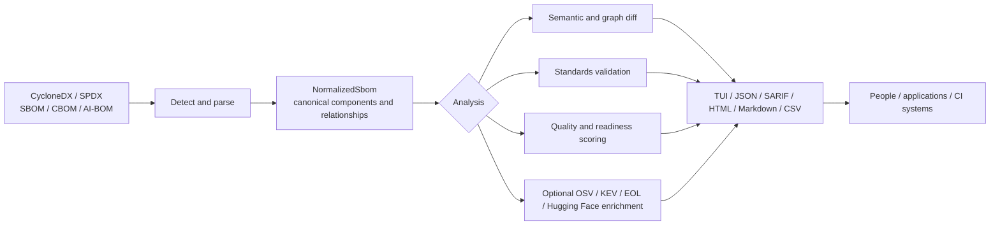

# Project overview

<!-- markdownlint-disable MD013 -->

`sbom-tools` turns software, cryptographic, and AI bills of materials into a
consistent view that people and automation can inspect, compare, validate, and
score.

The project answers practical questions:

- What is in this release?
- What changed from the previous release?
- Is the BOM complete enough for its intended use?
- Which findings should block a CI job?
- How can another tool consume the same analysis without reimplementing it?

## One engine, several interfaces

The Rust engine contains the parsers, canonical model, matching, diff,
validation, scoring, and report logic. Every interface delegates to that engine.

| Audience | Start with | Typical use |
| --- | --- | --- |
| Scientist or ML engineer | CLI, then Python binding | Inspect model and dataset metadata, compare model releases, measure AI-BOM readiness |
| Application developer | CLI or language binding | Parse and normalize BOMs inside an application |
| Security or compliance engineer | CLI | Validate requirements, enrich vulnerabilities, produce SARIF or JSON |
| CI/CD system | CLI | Apply documented exit-code gates and archive machine-readable reports |
| Tool integrator | C ABI, Go, Swift, Python, or Node.js binding | Reuse the engine without duplicating BOM semantics |

Python and Node.js bindings currently require a separately built native
library; no wheel, npm native package, or publishing automation is available
yet.

## End-to-end data flow

Normalization is the central contract. CycloneDX and SPDX inputs become the
same `NormalizedSbom` model before analysis. This lets downstream consumers use
one component, dependency, vulnerability, license, cryptography, model, and
dataset vocabulary.

## What the project owns

`sbom-tools` owns neutral BOM processing:

- format detection and parsing;
- canonical normalization and subject identity within a BOM;
- semantic and dependency-graph comparison;
- BOM-visible validation, quality, compliance, and AI-readiness findings;
- optional metadata enrichment;
- human-readable and machine-readable reports;
- language bindings over the stable C ABI.

## Where the boundary ends

`sbom-tools` produces analysis results; it does not decide organizational
authority or deployment policy. External systems may consume its JSON, SARIF,
or binding results as evidence, but remain responsible for:

- policy decisions and admission control;
- tenant, workspace, or authorization models;
- attestation servers and trusted-hardware verification;
- identity issuance, PKI, or secret management;
- durable evidence ledgers and cross-system provenance graphs;
- legal or regulatory authorization claims.

This boundary keeps the upstream project broadly reusable. Integrations should
consume public outputs rather than add an organization-specific control plane
to the core.

## Continue from here

- Follow the [scientist and developer journeys](USER_JOURNEYS.md).
- Read [Architecture](ARCHITECTURE.md) for internal modules and invariants.
- Read the [project briefing](PROJECT_BRIEF.md) for a compact, AI-readable
  orientation.
- Consult the root [README](../README.md) for the complete command reference.
