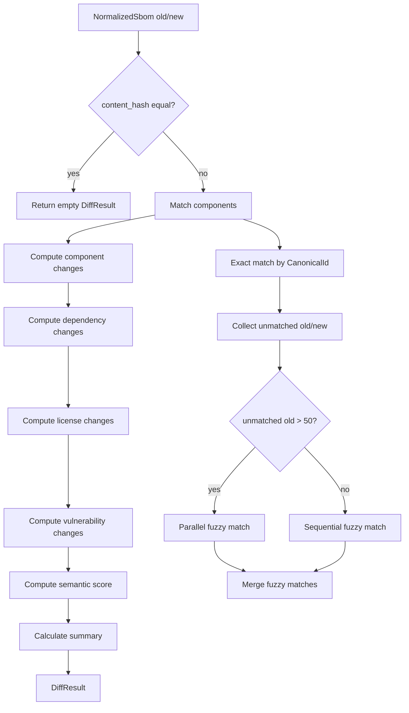
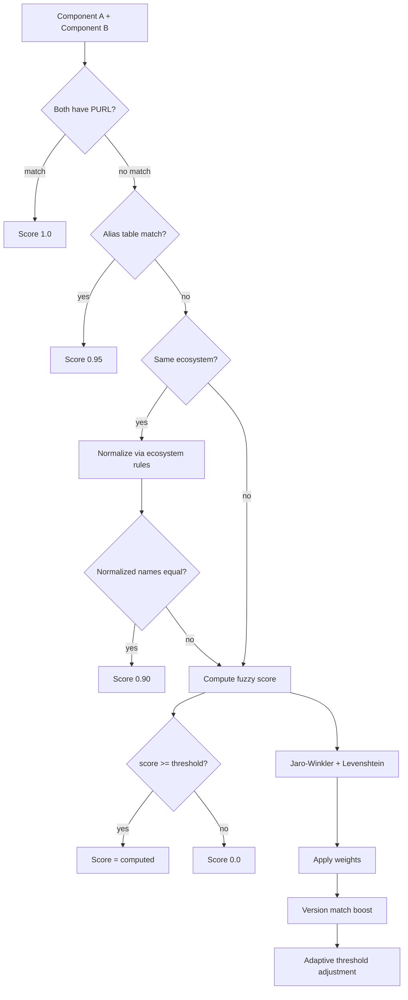
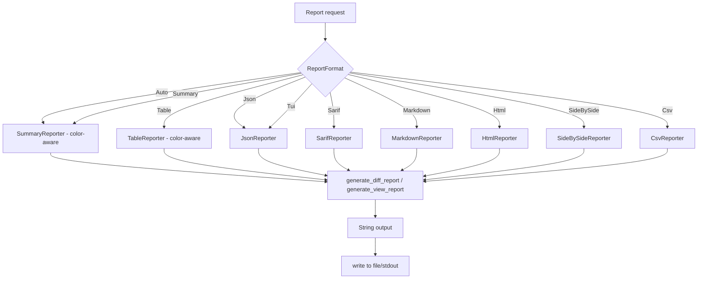
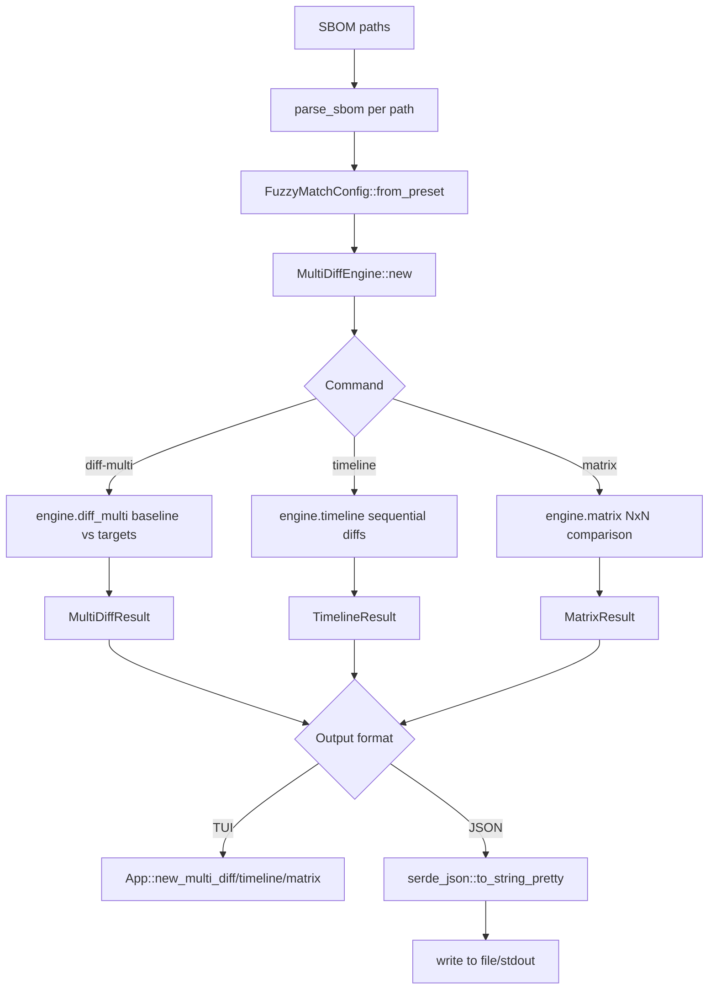
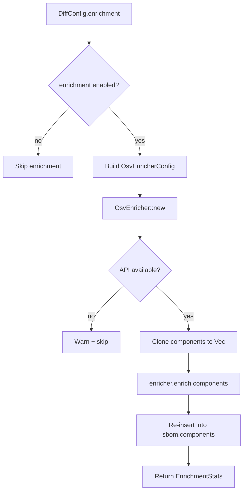
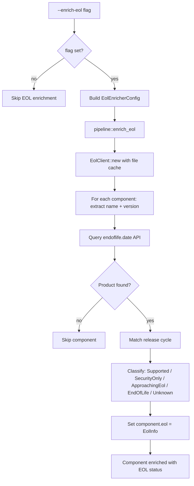

# Pipeline Diagrams

Conceptual process flows for non-stateful pipelines. These focus on data flow and
decision points rather than UI states.

## Diff Pipeline (DiffEngine::diff)
Source: `src/diff/engine.rs`

## Matching Pipeline (FuzzyMatcher::match_components)
Source: `src/matching/mod.rs` (with submodules: `scoring.rs`, `string_similarity.rs`, `adaptive.rs`, `lsh.rs`)

## Reporting Pipeline (Reporter selection + generation)
Source: `src/reports/mod.rs`

## Multi-SBOM Pipeline (diff-multi / timeline / matrix)
Source: `src/cli/multi.rs`, `src/diff/multi.rs`

Multi-SBOM commands bypass the standard pipeline and use `MultiDiffEngine` directly.

Note: No enrichment, no DiffConfig, no streaming, no report format variety.

## Vulnerability Enrichment Flow (feature-gated)
Source: `src/pipeline/parse.rs`, `src/cli/diff.rs`

## EOL Enrichment Flow (feature-gated)
Source: `src/enrichment/eol/`, `src/cli/diff.rs`, `src/cli/view.rs`

